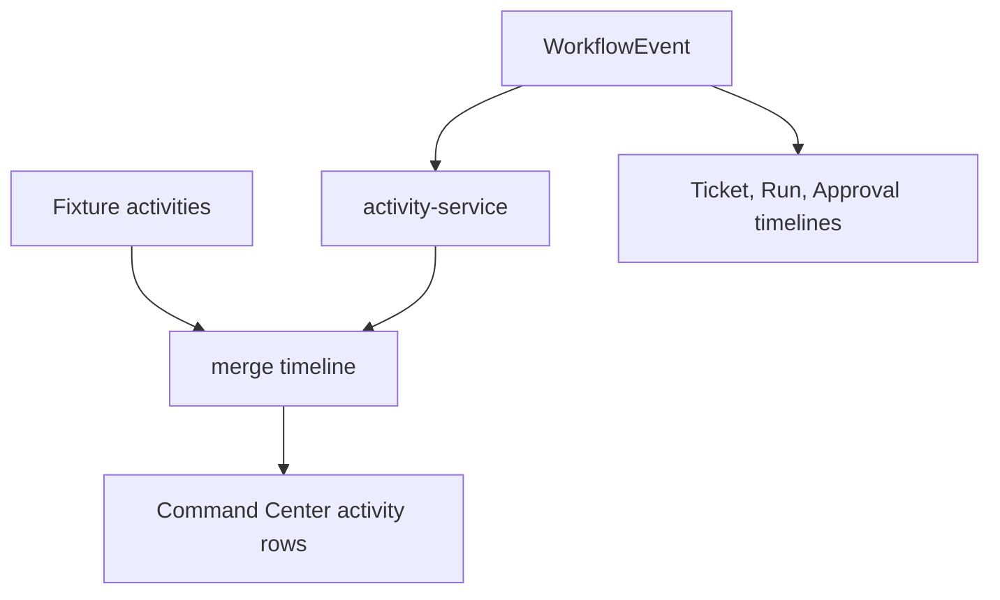

# Event System

## Event Contract

Workflow events are append-only records created by the shared workflow engine.

| Field | Meaning |
|---|---|
| `id` | Local event id |
| `command` | Workflow command name |
| `entityType` | Approval, ticket, or run |
| `entityId` | Entity affected by the command |
| `actorId` | Current demo actor |
| `title` | Timeline display title |
| `createdAt` | Event timestamp |
| `status` | Pending, success, or failed |
| `error` | Optional rollback reason |

## Activity Projection

`activity-service` projects workflow events into `Activity` rows so command-center recent activity and entity timelines can render from the same event source.

## Failure Simulation

The demo API consumes `sessionStorage["uikigai-demo-fail-next-command"]` when the value matches a command name. The next matching mutation rejects, the workflow engine restores the rollback snapshot, and the UI exposes an inline error through the selector-subscribed workflow state.

## Event Consumers

| Consumer | Use |
|---|---|
| `/command-center` | Recent activity projection |
| `/tickets/demo-ticket` | Ticket workflow timeline |
| `/runs/demo-run` | Run controls timeline |
| `/approvals` | Approval audit timeline |
| `smoke:workflow-actions` | Verifies optimistic success and rollback behavior |
