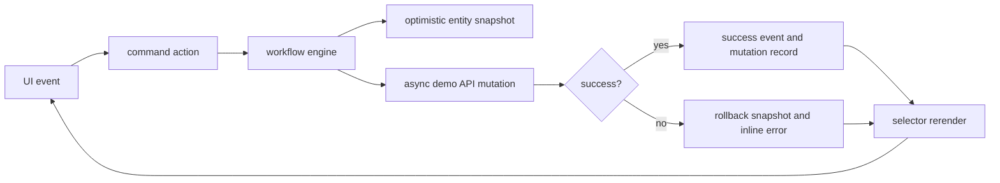

# Workflow Architecture

## Purpose

Real UI Demo v1 now supports operational workflow commands without bypassing shared state or selectors.

## Boundaries

| Boundary | Responsibility |
|---|---|
| `src/state/command-actions.ts` | Public workflow commands for approval, run, and ticket actions |
| `src/state/workflow-engine.ts` | Shared optimistic entity state, mutation records, rollback snapshots, subscriptions |
| `src/state/async-actions.ts` | Thin async adapter from commands to demo API mutations |
| `src/services/demo-api.ts` | Local mock latency and failure simulation, no network |
| `src/state/event-log.ts` | Workflow event schema and event creation |
| `src/services/activity-service.ts` | Maps workflow events into activity timeline rows |
| Selectors | Derive KPIs, cards, detail panels, and timeline rows from workflow-backed data |

## Command Surface

- `approveApproval`
- `rejectApproval`
- `retryRun`
- `pauseRun`
- `resumeRun`
- `assignTicket`
- `escalateTicket`
- `resolveTicket`

## Optimistic Lifecycle

1. A command captures a rollback copy of the current workflow entity graph.
2. The command writes an optimistic entity update into the workflow store.
3. The engine records a pending mutation and pending event.
4. The async demo API resolves or rejects after mock latency.
5. Success appends a success event and marks the mutation settled.
6. Failure restores the rollback snapshot, records the failure event, and exposes an inline error keyed by entity id.

## Reconciliation Rules

| Command group | Reconciliation |
|---|---|
| Approval decision | Approval status, decision, audit trail, command-center approval KPI, approval queue detail |
| Run control | Run status and current step, run inspector badge, workflow timeline |
| Ticket assignment | Ticket owner and agent ticket membership |
| Ticket escalation | Ticket priority and risk |
| Ticket resolve | Ticket status and linked run completion |

## Selector Dependency Map

| Selector/view model | Workflow-backed dependencies |
|---|---|
| Command center | Tickets, approvals, agents, activity timeline, cost |
| Tickets board | Ticket status, owner agent, run cost |
| Ticket detail | Selected ticket, owner agent, linked run, linked approval, ticket workflow events |
| Run console | Run status, ticket, agent, run workflow events |
| Approval center | Approval status, queue rows, selected approval, KPI counts |
| Workforce and org chart | Agent ticket membership and workload-derived rows |
