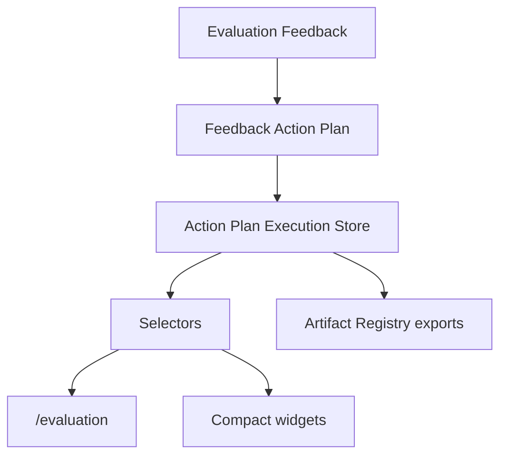

# Action Plan Execution Architecture

## Purpose

Action Plan Execution turns feedback action plans into trackable improvement work. It adds lifecycle state, progress, blockers, evidence, and timeline events without changing the existing AppShell or bypassing selectors.

## Flow

## Domain

| Model | Purpose |
|---|---|
| `ActionPlanExecution` | Execution state for a feedback action plan |
| `ActionTaskExecution` | Lifecycle, owner, progress, blocker, notes, and evidence for one task |
| `ActionExecutionEvent` | Timeline event generated by execution actions |
| `ActionProgressSnapshot` | Progress summary and readiness |
| `ActionCompletionEvidence` | Required proof when a task is completed |

## Lifecycle

Tasks support:

- `pending`
- `ready`
- `in_progress`
- `blocked`
- `review`
- `completed`
- `cancelled`

Only ready tasks can start. Blocked tasks require a blocker reason. Completed tasks require evidence. Dependencies block dependent tasks until prerequisite tasks are completed or cancelled.

## Persistence

`src/runtime/action-plan-execution-store.ts` stores execution state in `sessionStorage` under `uikigai-action-plan-execution-v1`. IDs are deterministic by plan/task, so repeated starts do not create duplicate execution records.

## Selectors

`src/domain/selectors.ts` exposes:

- `selectActionPlanExecution`
- `selectActionTaskExecutions`
- `selectActionExecutionTimeline`
- `selectActionPlanProgress`
- `selectBlockedActionExecutions`
- `selectCompletedActionExecutions`
- `selectActionCompletionEvidence`
- `selectWorkspaceImprovementProgress`

## UI

`/evaluation` shows:

- action execution progress bar
- task lifecycle board
- blocked task panel
- completion evidence panel
- execution timeline
- start/block/complete/cancel actions

Compact execution widgets are attached to:

- `/runs/demo-run`
- `/execution-timeline`
- `/execution-graph`
- `/artifacts`

## Artifact Exports

Action execution registers:

- `action-execution.json`
- `action-execution-timeline.md`
- `action-completion-evidence.json`
- `workspace-improvement-progress.md`
