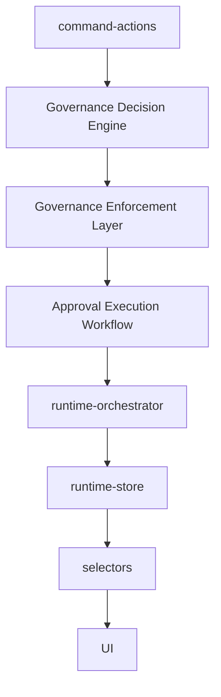

# Approval Execution Architecture

Sprint 7Q adds the reviewer workflow that sits after Governance Enforcement and before runtime continuation.

## Lifecycle

| Stage | State |
|---|---|
| Governance requires approval | `PENDING_REVIEW` |
| Reviewer approves | `APPROVED` |
| Runtime resumes | `RESUMED` |
| Reviewer rejects | `REJECTED` |
| Runtime cancels | `CANCELLED` |
| Request ages out | `EXPIRED` |

Only `ApprovalHold` records created by the Governance Enforcement Layer can create approval execution requests.

## Reviewer Decision Model

Supported decisions:

- `APPROVE`
- `REJECT`
- `REQUEST_CHANGES`
- `ESCALATE`

`REQUEST_CHANGES` keeps the execution on hold. `ESCALATE` keeps the hold active and raises priority to high.

## Resume And Cancel Rules

- Direct resume is blocked unless a reviewer decision first sets the request to `APPROVED`.
- Rejected requests must be cancelled before the blocked runtime target can be considered closed.
- A cancelled, rejected, or expired request blocks its target through `assertApprovalExecutionAllowsRuntime()`.

## Audit Trail

Every reviewer decision records:

- authorization decision through RBAC/Authorization Audit
- governance decision report
- governance enforcement event
- approval execution event
- runtime event

## Artifact Export

Approval execution exports are generated through the existing Artifact Viewer path:

- `approval-execution-report.md`
- `approval-decisions.json`
- `approval-timeline.md`
- `rejected-executions.json`
- `resumed-executions.json`

## Future Backend Persistence

The current implementation uses `sessionStorage` to keep the demo frontend deterministic. A backend adapter can replace the store while preserving the same request, decision, event, and report contracts.
