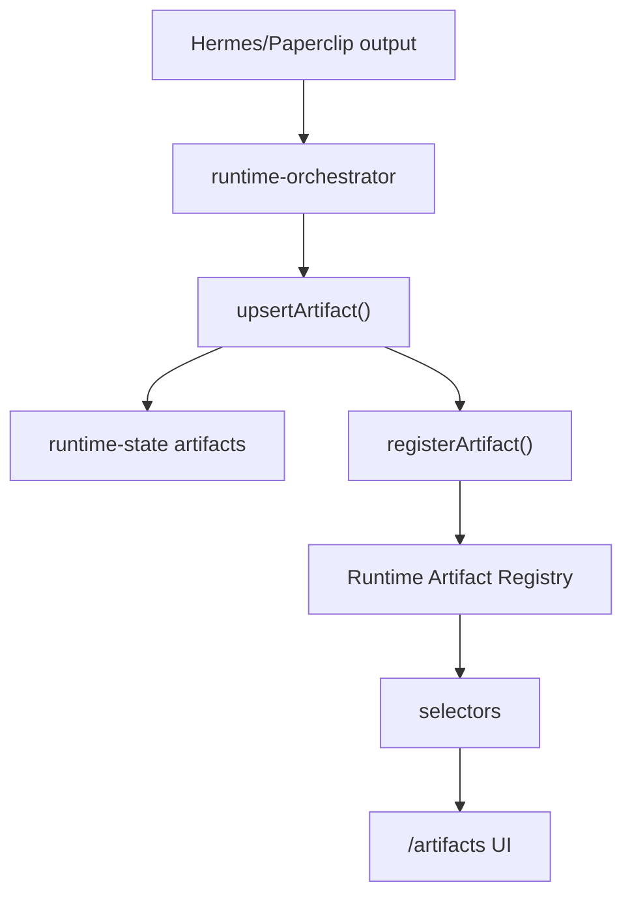

# Runtime Artifact Registry Architecture

## Purpose

The Runtime Artifact Registry is the single source of truth for generated runtime artifacts in the GrowthOS frontend. It indexes artifacts produced by Hermes, Paperclip, governance exports, approval workflows, runtime reports, plans, and other generated files without introducing deployment behavior.

## Domain

Core files:

- `src/runtime/artifact-registry.ts`
- `src/runtime/artifact-registry-store.ts`

Models:

- `ArtifactRecord`: canonical artifact index record.
- `ArtifactVersion`: immutable version entry for an artifact record.
- `ArtifactMetadata`: workspace, run, tool, source, summary, language, URL, size, and tags.
- `ArtifactLifecycle`: `CREATED`, `INDEXED`, `AVAILABLE`, `ARCHIVED`, `DELETED`.

Supported registry types:

- `REPORT`
- `FILE`
- `EXPORT`
- `PLAN`
- `POLICY`
- `APPROVAL`
- `AUDIT`
- `RUNTIME_OUTPUT`

## Storage

The registry persists in browser `sessionStorage` under `uikigai-artifact-registry-v1`.

The existing runtime artifact store remains responsible for runtime state compatibility. `upsertArtifact()` now also registers artifacts in the registry, so all existing runtime artifact producers automatically feed the registry without duplicate registration.

## Integration Flow

## Search And Filtering

`searchArtifacts()` supports:

- text query
- artifact type
- workspace
- run
- lifecycle status
- date range
- sort field and direction

Selectors:

- `selectArtifactById`
- `selectArtifactsByRun`
- `selectArtifactsByWorkspace`
- `selectArtifactVersions`
- `selectRecentArtifacts`

## Export Artifacts

Generated export payloads:

- `artifact-registry.json`
- `artifact-summary.md`
- `artifact-health-report.md`

These are export payloads generated from registry state. Sprint 8B does not implement deployment or external file delivery.

## UI

`/artifacts` now renders the registry view model, including:

- registry cards
- search input
- type filter
- lifecycle filter
- sort selector
- registry health panel
- run linkage counts

The UI does not call Hermes or Paperclip. It reads through selectors and registry store only.

## Boundaries

Sprint 8B does not modify:

- governance logic
- approval logic
- deployment logic
- AppShell geometry
- bbox contracts
