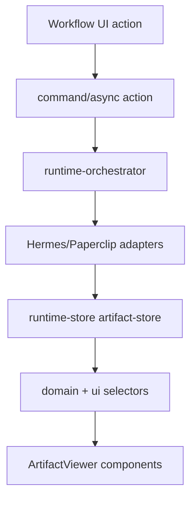

# Artifact Viewer Architecture

## Purpose

Runtime outputs from Hermes and Paperclip are rendered through a shared artifact viewer instead of ad hoc artifact rows inside individual screens. UI components never call Hermes or Paperclip directly; artifacts flow through runtime adapters, runtime-store, selectors, and controlled viewer props.

## Data Flow

## Artifact Contract

Artifacts support markdown, code, json, patch, report, link, image, and unknown outputs. The normalized internal model stores source, summary text, optional raw text, optional JSON payload, language, URL, creation time, and optional size.

## Selectors

| Selector | Role |
|---|---|
| `getArtifactsForRun(runId)` | Merges runtime artifacts with fixture artifacts for a run. |
| `getPrimaryArtifactForRun(runId)` | Selects the best report/markdown/code/json/patch artifact for preview. |
| `getArtifactById(artifactId)` | Resolves runtime artifacts first, then fixture artifacts. |
| `getArtifactPreviewModel(artifactId)` | Produces UI-safe preview metadata and content. |

## Viewer Components

| Component | Role |
|---|---|
| `ArtifactViewer` | Controlled list + preview container. |
| `ArtifactList` | Selectable artifact rows with type/source metadata. |
| `ArtifactPreviewPanel` | Metadata and type-specific preview shell. |
| `MarkdownArtifactView` | Lightweight markdown rendering for reports. |
| `CodeArtifactView` | Code block preview. |
| `JsonArtifactView` | Pretty JSON preview. |
| `PatchArtifactView` | Diff/patch preview. |
| `LinkArtifactView` | External artifact link. |
| `UnknownArtifactView` | Safe summary fallback. |

## Route Wiring

| Route | Artifact behavior |
|---|---|
| `/runs/demo-run` | Shows artifact list, selected artifact, source badge, metadata, and preview in the run inspector. |
| `/tickets/demo-ticket` | Shows latest linked run output summary and link to the run console. |
| `/approvals` | Shows related artifact metadata and summary for the selected approval when it is tied to a runtime run. |

## Boundaries

- UI receives artifacts only from shared selectors and runtime-store.
- Selection is stored in `ui-state` through `selectArtifact()`.
- Mock and sandbox modes both normalize into the same artifact shape.
- No parity screenshots, background images, or static slices are used.
