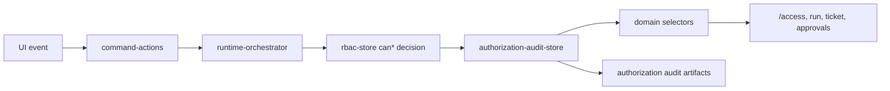

# Authorization Audit Architecture

## Purpose

Sprint 7M adds governance observability on top of the Sprint 7L RBAC enforcement layer. RBAC still decides whether an action is allowed. The audit layer records each decision, classifies risk, builds review queues, and exports evidence artifacts.

## Runtime Flow

## Event Model

`AuthorizationAuditEvent` records:

- actor, role, organization, tenant, and workspace
- action, resource type, and resource id
- allowed/denied result
- denied reason and missing permissions
- risk level: `LOW`, `MEDIUM`, `HIGH`, `CRITICAL`
- source of the decision

The audit store persists events in `sessionStorage` under `uikigai-authorization-audit-v1`.

## RBAC Integration

`src/runtime/rbac-store.ts` remains the single entry for authorization helpers such as:

- `canStartRun`
- `canApprovePlan`
- `canApproveDeployment`
- `canExportArtifact`
- `canOverrideBudget`
- `canModifyPolicy`

`persistDecision()` records every `AuthorizationDecision` into `authorization-audit-store`. No duplicate permission logic is introduced.

## Risk Rules

| Rule | Risk |
|---|---|
| Denied budget override | HIGH |
| Denied deployment approval | CRITICAL |
| Denied policy edit | HIGH |
| Repeated denied action >= 3 times | HIGH |
| Organization edit denied | CRITICAL |

High and critical events create review queue items.

## Selectors

The domain selector layer exposes read-only audit selectors:

- `selectAuthorizationAuditEvents`
- `selectDeniedActionSummary`
- `selectAuthorizationRiskSummary`
- `selectHighRiskAuthorizationEvents`
- `selectAuthorizationReviewQueue`
- `selectAuthorizationAuditByWorkspace`
- `selectAuthorizationAuditByTenant`
- `selectAuthorizationAuditByActor`

`selectAccessControlViewModel()` merges RBAC role/permission data with authorization audit summaries for `/access`.

## UI Wiring

`/access` displays:

- authorization events
- denied actions
- high-risk events
- review queue
- actor breakdown
- workspace/tenant summary through selectors

`/runs/demo-run`, `/tickets/demo-ticket`, and `/approvals` surface compact audit counts inside existing risk/runtime rows without changing AppShell or route layout architecture.

## Artifact Exports

`exportAuthorizationAuditArtifacts()` writes artifacts through the existing runtime orchestrator and artifact store:

- `authorization-audit-summary.md`
- `authorization-risk-report.md`
- `authorization-events.json`
- `denied-actions-report.md`

## Backend Plan

The current implementation is frontend/sessionStorage only. A future backend adapter can replace `authorization-audit-store` persistence with an append-only audit log while keeping the event model and selectors stable.
