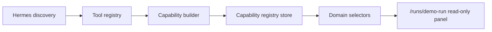

# Capability Registry Architecture

## Purpose

The capability registry sits above the Hermes Tool Registry and answers a product-level question: which workflows can the current Hermes tool/model set support?

It does not execute tools. Runtime execution stays in:

```text
command-actions -> async-actions -> runtime-orchestrator -> adapters -> clients
```

## Data Flow



## Capability Model

`HermesCapability` includes:

- `id`
- `name`
- `description`
- `requiredTools`
- `optionalTools`
- `supportedModels`

The builder derives these capabilities from discovered tool metadata:

- Research
- Analysis
- Artifact Generation
- Approval Handling
- Planning
- Execution
- Deployment

## Workflow Readiness

`WorkflowReadiness` compares workflow requirements with available capabilities:

- `workflowId`
- `requiredCapabilities`
- `availableCapabilities`
- `missingCapabilities`
- `ready`

The default workflows are:

| Workflow | Required capabilities |
|---|---|
| `demo-run-execution` | research, planning, execution, artifact-generation |
| `approval-gated-artifact` | planning, execution, artifact-generation, approval-handling |
| `deployment-readiness` | planning, execution, deployment |

## Persistence

`src/runtime-store/capability-registry-store.ts` persists the capability registry in `sessionStorage`.

The store tracks the source tool-registry timestamp. If the tool registry changes, the capability registry rebuilds automatically.

## UI Boundary

React components do not import Hermes clients or discovery modules directly. `/runs/demo-run` reads:

- `selectCapabilities()`
- `selectWorkflowReadiness()`
- `selectMissingCapabilities()`

through the existing Run Console view model.
