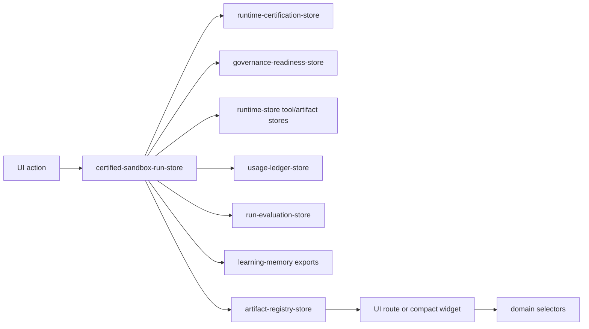

# Certified Sandbox Run Architecture

## Purpose

The certified sandbox run layer executes a full Hermes/Paperclip-style workflow only after runtime certification and sandbox preflight gates are satisfied.

It preserves the required flow:

## Runtime Gate

Preflight blocks execution when:

- Runtime certification is missing.
- Runtime certification is neither `passed`, `certified`, nor mock-safe `warning`.
- A production-looking Hermes/Paperclip endpoint is detected.
- Runtime mode is `production`.
- Sandbox health is `offline`.
- Governance readiness reports blockers.

Preflight requires approval when:

- Certification has warning findings.
- Sandbox env is missing but mock fallback remains active.
- Sandbox health is degraded or missing config.

## Workflow Simulation

The run uses `DEMO_RUN_ID` as the workflow run anchor so existing runtime-store, usage ledger, artifact registry, evaluation, and learning-memory surfaces receive evidence without layout changes or backend calls.

The flow records:

1. Ticket/run creation intent.
2. Run plan and capability readiness steps.
3. Governance and approval evaluation.
4. Certified sandbox execution start.
5. Deterministic Hermes-style tool call.
6. Paperclip-compatible artifact.
7. Usage ledger records.
8. Run evaluation score.
9. Learning memory export/audit event.
10. Final export artifact package.

## Artifact Exports

The layer registers:

- `certified-sandbox-run-report.md`
- `certified-sandbox-run.json`
- `certified-sandbox-preflight.md`
- `certified-sandbox-audit.json`
- `certified-sandbox-artifacts.md`
- `certified-sandbox-final-summary.md`

## UI Surfaces

Full route:

- `/certified-sandbox-run`

Compact selector-driven widgets:

- `/runtime-certification`
- `/runs/demo-run`
- `/execution-timeline`
- `/execution-graph`
- `/artifacts`
- `/evaluation`
- `/worker-control`
- `/chaos`

## Safety

The layer never calls production endpoints and does not import Hermes/Paperclip clients into UI. It relies on runtime certification state, sandbox safety checks, governance readiness, runtime stores, and mock-safe deterministic runtime evidence.
