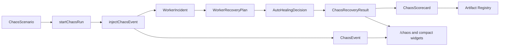

# Chaos Simulation Architecture

## Purpose

Sprint 8S adds a controlled chaos simulation layer for validating worker recovery, auto-healing, governance, queue safety, and runtime reliability. Chaos simulation is intentionally isolated from Hermes and Paperclip clients. It writes only demo/runtime state and always reports `runtimeMode: chaos_mock` with `realEndpointCalls: 0`.

## Flow

## Isolation Rules

- Chaos simulation does not import Hermes or Paperclip clients.
- Every run is persisted with `runtimeMode: chaos_mock`.
- Every run is persisted with `realEndpointCalls: 0`.
- Sandbox outage scenarios create auditable mock outage events only.
- High-risk recovery stays behind the Worker Recovery approval gate.
- Kill-switch scenarios call the existing governance store and stop new autonomous loop execution.

## Scenario Types

- `worker_stale`
- `worker_heartbeat_missing`
- `queue_retry_exhausted`
- `governance_blocked`
- `approval_timeout`
- `sandbox_offline`
- `tool_call_failure`
- `artifact_export_failure`
- `quota_exceeded`
- `cost_spike`
- `recovery_loop_failure`
- `kill_switch_triggered`

## Store

`src/runtime/chaos-simulation-store.ts` persists:

- chaos scenarios
- chaos runs
- auditable chaos events
- injections
- recovery results
- scorecards
- exported artifact IDs

Storage key: `uikigai-chaos-simulation-v1`.

## UI

The `/chaos` route renders:

- Chaos Readiness
- Scenario Library
- Active Chaos Run
- Injected Failures
- Recovery Response
- Auto-Healing Result
- Governance / Kill-Switch Behavior
- Scorecard
- Exported Reports

Compact selector-driven widgets are rendered on worker control, worker recovery, evaluation, execution timeline, execution graph, and agent detail surfaces.

## Artifact Exports

- `chaos-scenario.json`
- `chaos-run-report.md`
- `chaos-events.json`
- `chaos-recovery-scorecard.md`
- `chaos-safety-report.md`
