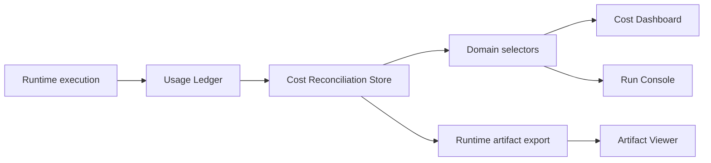

# Cost Reconciliation Architecture

## Purpose

Cost Reconciliation converts runtime usage ledger data into financial governance metrics. It compares:

- estimated cost from execution planning and usage ledgers
- actual usage cost from runtime records
- simulated provider cost snapshots

No real provider connection is used in Sprint 7I.

## Data Flow

## Store Design

`src/runtime/cost-reconciliation-store.ts` persists:

- provider cost snapshots
- reconciliation reports
- variance history
- cost alerts

The store rebuilds reports from `getBillingLedgers()` and `getAllUsageRecords()`. Provider costs are deterministic mock snapshots derived from ledger totals.

## Domain Model

`src/runtime/cost-reconciliation.ts` defines:

- `CostRecord`
- `CostVariance`
- `ProviderCostSnapshot`
- `CostAlert`
- `ReconciliationReport`

Severity thresholds:

| Variance % | Severity |
|---:|---|
| 0-5% | NORMAL |
| >5-10% | WARNING |
| >10% | CRITICAL |

## Selectors

Selectors in `src/domain/selectors.ts` expose reconciliation data:

- `selectReconciliationReport()`
- `selectVarianceHistory()`
- `selectCostVariance()`
- `selectVarianceSeverity()`
- `selectProviderCost()`
- `selectEstimatedVsActual()`
- `selectCostAlerts()`

Routes read only from selectors and existing view models.

## Dashboard Architecture

`/cost` displays:

- Estimated Cost
- Actual Cost
- Provider Cost
- Variance
- Variance %
- Severity
- Top Cost Runs
- Recent Alerts
- Variance Trend

`/runs/demo-run` displays reconciliation status in the existing inspector cost card.

## Artifact Exports

`exportCostReconciliationArtifacts()` writes artifacts through the runtime orchestrator:

- `cost-report.json`
- `cost-report.md`
- `reconciliation-report.md`

These artifacts use the existing runtime artifact store and Artifact Viewer.

## Future Provider Integrations

Real provider integration can replace deterministic provider snapshots by inserting authenticated provider billing snapshots into the reconciliation store. UI and selectors do not need direct provider access.
