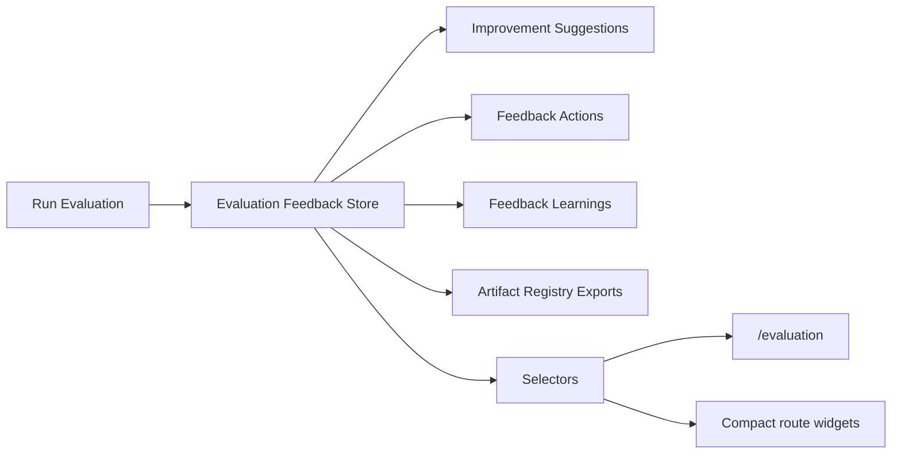

# Evaluation Feedback Architecture

## Purpose

The evaluation feedback layer converts run quality scoring into actionable improvement suggestions for future agent runs. It sits above Run Evaluation and remains selector-driven for UI consumption.

## Flow

## Domain

- `EvaluationFeedback`: one feedback record per run.
- `ImprovementSuggestion`: categorized recommendation with priority and expected impact.
- `FeedbackAction`: owner, status, and due horizon for acting on the suggestion.
- `FeedbackLearning`: durable learning signal derived from repeated evaluation issues.

## Categories

- `prompt_improvement`
- `tool_selection`
- `artifact_quality`
- `approval_process`
- `governance_policy`
- `cost_optimization`
- `replay_integrity`
- `workflow_design`

## Generation Rules

| Low score / issue | Feedback category |
|---|---|
| `task_completion` | `prompt_improvement` |
| `artifact_quality` | `artifact_quality` |
| `tool_success` | `tool_selection` |
| `approval_compliance` | `approval_process` |
| `governance_compliance` | `governance_policy` |
| `cost_efficiency` | `cost_optimization` |
| `replay_integrity` | `replay_integrity` |

## Persistence

Feedback records are persisted in `sessionStorage` under `uikigai-evaluation-feedback-v1`. The store keeps one stable feedback ID per run and increments `version` when regenerated.

## Exports

The feedback layer registers the following artifacts through the Artifact Registry:

- `evaluation-feedback.json`
- `improvement-suggestions.md`
- `feedback-actions.json`
- `workspace-feedback-summary.md`

## UI Surfaces

- `/evaluation`: feedback summary, top suggestions, priority breakdown, recommended actions, actions table.
- `/runs/demo-run`: compact feedback widget.
- `/execution-timeline`: compact feedback widget.
- `/execution-graph`: compact feedback widget.
- `/artifacts`: compact feedback widget.

## Boundaries

- No direct Hermes or Paperclip calls.
- No AppShell layout changes.
- No static screenshots or parity image usage.
- UI reads feedback through selectors/store.
