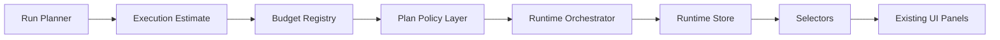

# Execution Budget Architecture

## Purpose

Execution budget governance estimates run-plan cost, duration, token usage, and risk before a plan starts. It extends the existing path:

The UI does not import Hermes or Paperclip clients and does not calculate budget locally.

## Domain

`src/integrations/growthos-runtime/execution-budget.ts` defines:

- `ToolCostProfile`
- `ModelCostProfile`
- `ExecutionBudget`
- `ExecutionEstimate`
- `ExecutionBudgetReport`

The registry persists in `sessionStorage` through `src/runtime-store/execution-budget-store.ts`.

## Estimation Rules

The planner derives:

- `estimatedCost`
- `estimatedDuration`
- `estimatedRisk`

Estimates combine tool profiles and model profiles. Unknown tools fall back to deterministic estimates based on capability/output type.

## Budget Policies

| Policy | Behavior |
|---|---|
| `budget_limit_exceeded` | Blocks plans whose estimate exceeds `budget.maxCost`. |
| `high_risk_execution` | Blocks plans whose estimated risk exceeds the configured maximum. |
| `expensive_model_requires_approval` | Requires approval for plans above `budget.approvalCost`. |
| `deployment_requires_budget_review` | Requires budget review for deployment workflows. |

Budget policy results are folded into the existing plan policy report so `startRunFromPlan()` has one governance decision point.

## UI Surface

Existing screens render budget state from selectors:

- `/tickets/demo-ticket`: estimated cost, duration, risk, budget status.
- `/runs/demo-run`: execution estimate in the inspector/cost panel.
- `/approvals`: budget approval requests are counted in the KPI band and appear in the approval queue.
