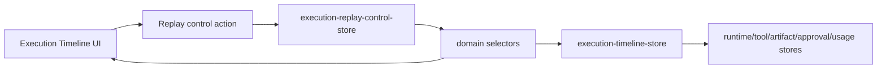

# Execution Replay Control Architecture

## Purpose

Sprint 8E adds an interactive replay control layer on top of Execution Timeline. Timeline generation stays deterministic and selector-driven; replay control stores only UI playback state.

## Flow

## State Model

`ExecutionReplayControlState` persists per run:

| Field | Purpose |
|---|---|
| `runId` | Runtime run being replayed |
| `status` | `playing` or `paused` |
| `playbackSpeed` | `0.5x`, `1x`, or `2x` |
| `selectedFrameIndex` | Current zero-based replay frame |
| `selectedEventId` | Current timeline event |
| `updatedAt` | Last control mutation time |

State is persisted in `sessionStorage` under `uikigai-execution-replay-control-v1`.

## Actions

| Action | Behavior |
|---|---|
| `playReplay` | Sets control state to playing |
| `pauseReplay` | Sets control state to paused |
| `stepReplayForward` | Moves one frame forward and pauses |
| `stepReplayBackward` | Moves one frame backward and pauses |
| `jumpToReplayFrame` | Moves to an exact frame and syncs event selection |
| `resetReplay` | Returns to frame zero |
| `setReplayPlaybackSpeed` | Persists speed preference |
| `selectReplayEvent` | Selects event and jumps to its frame if found |

## Debug Inspector

`selectReplayDebugSnapshot()` resolves the current replay frame into:

| Field | Source |
|---|---|
| current frame | replay control + timeline frames |
| event id/type/source/severity | selected timeline event |
| run state | replay frame state |
| active step/tool | replay frame state |
| artifacts | artifact registry |
| approvals | approval store |
| cost/usage | replay state + usage ledger |
| raw JSON | normalized snapshot |

## UI Integration

`/execution-timeline` renders:

- Replay control bar.
- Frame progress indicator.
- Speed selector.
- Event detail inspector.
- Debug JSON panel.
- Runtime state summary.
- Linked artifact/tool/approval/cost references.

Compact hidden widgets are exposed on:

- `/runs/demo-run`
- `/execution-graph`

## Constraints

- No direct Hermes/Paperclip imports.
- No AppShell or bbox contract changes.
- No static screenshots or parity slices.
- Runtime truth remains in runtime stores and selectors.
