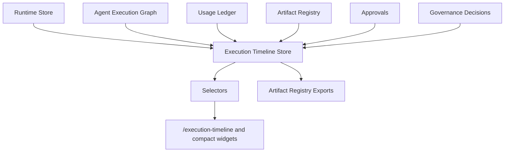

# Execution Timeline & Replay Architecture

## Purpose

The execution timeline turns runtime state into a replayable operational trace. It sits above the Agent Execution Graph, runtime store, tool calls, artifacts, approvals, usage ledger, and governance decisions.

## Data Flow

## Domain

`src/runtime/execution-timeline.ts` defines:

- `ExecutionTimeline`
- `ExecutionTimelineEvent`
- `ExecutionReplayFrame`
- `ExecutionReplayState`
- `ExecutionReplaySummary`

Events cover run, plan, step, tool, artifact, approval, governance, usage, cost, and terminal lifecycle changes.

## Store

`src/runtime/execution-timeline-store.ts` builds timelines for run, agent, and ticket scopes, persists snapshots in `sessionStorage`, and prevents duplicate event IDs with deterministic IDs.

Replay frames are derived from sorted events. Each frame accumulates:

- current step
- completed steps
- active and completed tools
- produced artifacts
- approval status
- governance decision
- accumulated cost and usage
- final run state

## UI

`/execution-timeline` renders a DOM-only timeline and replay panel. Compact selector-backed widgets are exposed on:

- `/runs/demo-run`
- `/tickets/demo-ticket`
- `/agents/demo-agent`
- `/execution-graph`

## Exports

Timeline exports are registered through the Artifact Registry:

- `execution-timeline.json`
- `execution-timeline.md`
- `execution-replay.json`
- `execution-replay-summary.md`

## Boundaries

The timeline layer does not call Hermes or Paperclip directly. It reads normalized runtime state and registry data only through existing stores and selectors.
