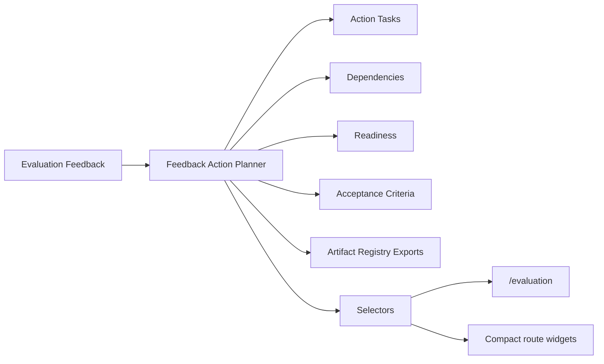

# Feedback Action Planner Architecture

## Purpose

The Feedback Action Planner converts Evaluation Feedback suggestions into executable, dependency-aware improvement plans.

## Flow

## Domain

- `FeedbackActionPlan`: stable plan per feedback record.
- `FeedbackActionTask`: executable task generated from one suggestion.
- `FeedbackActionDependency`: blocking relationship between action tasks.
- `FeedbackActionAcceptanceCriteria`: testable completion criteria per task.

## Statuses

- `draft`
- `ready`
- `blocked`
- `in_progress`
- `completed`
- `cancelled`

## Planner Rules

| Suggestion category | Planner behavior |
|---|---|
| `governance_policy` | Creates governance review task |
| `cost_optimization` | Creates budget review task |
| `tool_selection` | Creates tool capability validation task |
| `artifact_quality` | Creates output schema/checklist task |
| `replay_integrity` | Creates instrumentation task |
| `prompt_improvement` | Creates prompt and planning task |
| `workflow_design` | Creates workflow sequencing task |

Critical feedback becomes a ready task. High-priority feedback becomes ready unless blocked by dependency. Dependencies are evaluated before readiness is exposed to selectors.

## Persistence

Plans are persisted in `sessionStorage` under `uikigai-feedback-action-plan-v1`. The plan ID is stable for a feedback record and the version increments when regenerated.

## Exports

The planner registers these artifacts through the Artifact Registry:

- `feedback-action-plan.json`
- `feedback-action-plan.md`
- `feedback-action-tasks.json`
- `improvement-roadmap.md`

## UI Surfaces

- `/evaluation`: action plan panel, task list, readiness, dependencies, acceptance criteria.
- `/runs/demo-run`: compact action plan widget.
- `/execution-timeline`: compact action plan widget.
- `/execution-graph`: compact action plan widget.
- `/artifacts`: compact action plan widget.

## Boundaries

- No AppShell changes.
- No static screenshot usage.
- No Hermes/Paperclip calls from UI.
- UI reads action plans through selectors and runtime stores.
