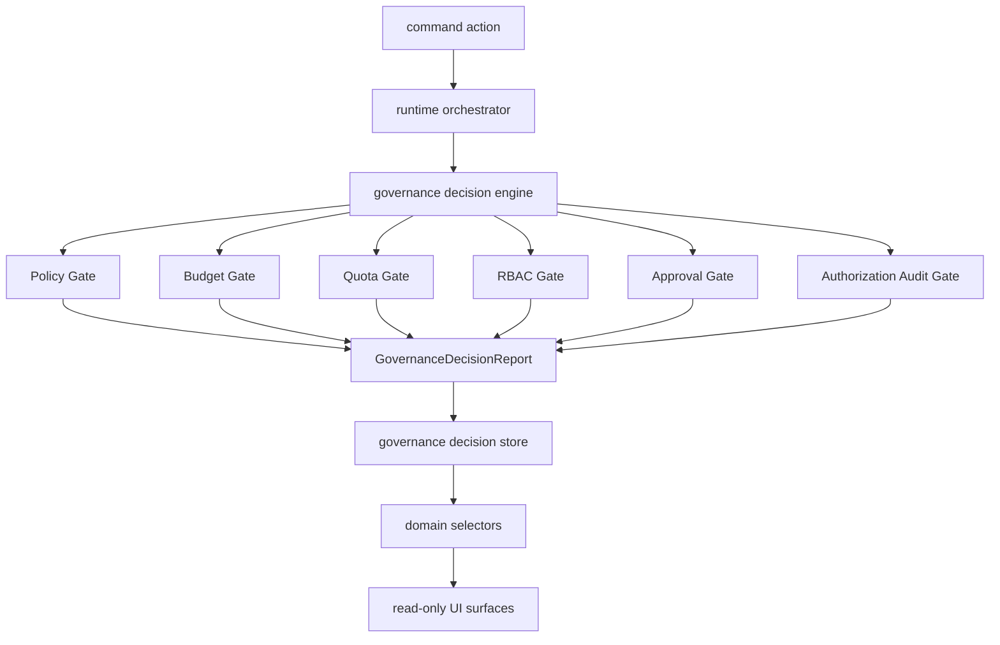

# Governance Decision Engine Architecture

## Purpose

Sprint 7O adds a unified governance decision layer above the existing policy, budget, quota, RBAC, approval, and authorization audit engines. It does not replace those engines. It orchestrates their results into one decision report that runtime execution, selectors, UI, smoke tests, and artifacts can read consistently.

## Decision Flow



## Decision Model

`GovernanceDecision` values:

- `ALLOW`
- `DENY`
- `REQUIRE_APPROVAL`
- `BLOCKED_BY_POLICY`
- `BLOCKED_BY_BUDGET`
- `BLOCKED_BY_QUOTA`
- `BLOCKED_BY_RBAC`

`GovernanceDecisionReport` includes:

- the final decision
- ordered gate results
- violations
- warnings
- approval requirements
- blocking reasons
- timestamp and target context

## Gate Order

| Order | Gate | Source Engine |
|---:|---|---|
| 1 | Policy Gate | Plan policy and policy inheritance |
| 2 | Budget Gate | Execution budget governance |
| 3 | Quota Gate | Usage ledger quota evaluation |
| 4 | RBAC Gate | RBAC authorization decisions |
| 5 | Approval Gate | Plan policy and approval-required steps |
| 6 | Authorization Audit Gate | Authorization audit summary |

Decision precedence is intentionally strict: RBAC and explicit deny outcomes beat quota, budget, policy, and approval-required outcomes. Authorization audit is observability-only and emits warnings unless another gate blocks.

## Runtime Integration

The runtime orchestrator records governance reports before sensitive actions:

- plan approval
- plan execution
- run request
- artifact export
- deployment governance
- budget override governance

Execution remains routed through:

```text
command-actions -> runtime-orchestrator -> governance decision engine -> selectors -> UI
```

React components do not import Hermes, Paperclip, or low-level governance clients directly.

## Store

`src/runtime/governance-decision-store.ts` persists:

- decision history
- evaluation reports
- blocked executions
- warnings

Session storage is used for the demo runtime. The API shape is stable enough to replace with a backend persistence adapter later.

## Selectors

The domain selector layer exposes:

- `selectGovernanceDecisionHistory`
- `selectBlockedExecutions`
- `selectGovernanceWarnings`
- `selectGovernanceSummary`
- `selectDecisionReport`
- `selectGateFailures`
- `selectGovernanceDecisionViewModel`

The access, policy, ticket, and run view models consume the same summary instead of reimplementing governance logic.

## UI Surfaces

| Route | Surface |
|---|---|
| `/governance` | Full governance decision dashboard |
| `/access` | Compact governance status panel |
| `/policies` | Compact governance decision summary |
| `/tickets/demo-ticket` | Compact governance status in ticket side panel |
| `/runs/demo-run` | Compact governance status in run inspector |

## Artifacts

The runtime orchestrator can export:

- `governance-decision-report.md`
- `governance-violations.json`
- `blocked-executions.json`
- `approval-required-report.md`

## Future Backend Plan

The current implementation is client-side and deterministic for smoke testing. A backend can persist decision reports, sign reports for auditability, and enforce decisions server-side while preserving the current store and selector contracts.
