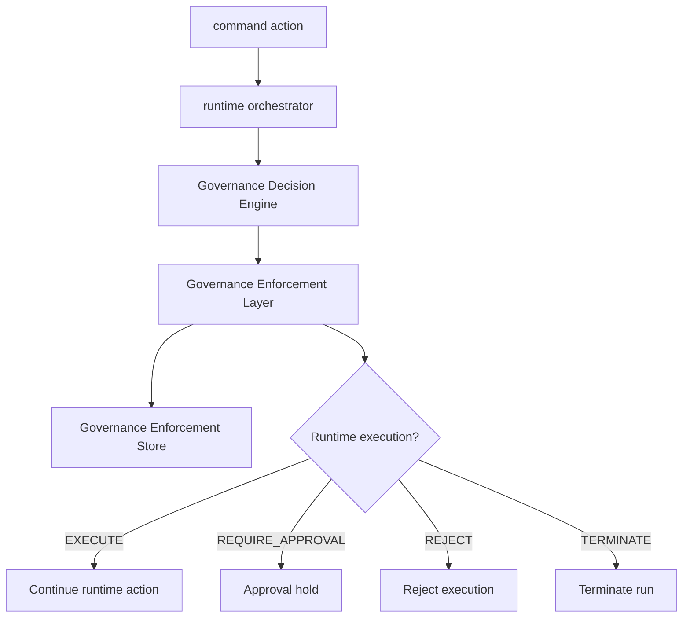

# Governance Enforcement Architecture

## Purpose

Sprint 7P makes governance decisions mandatory before runtime execution. The Governance Decision Engine still evaluates policy, budget, quota, RBAC, approval, and audit gates. The Governance Enforcement Layer converts the resulting decision into an execution outcome and records the enforcement evidence.

## Enforcement Flow

## Decision To Action Mapping

| Governance Decision | Enforcement Action |
|---|---|
| `ALLOW` | `EXECUTE` |
| `REQUIRE_APPROVAL` | `REQUIRE_APPROVAL` |
| `DENY` | `REJECT` |
| `BLOCKED_BY_POLICY` | `REJECT` |
| `BLOCKED_BY_BUDGET` | `REJECT` |
| `BLOCKED_BY_QUOTA` | `REJECT` |
| `BLOCKED_BY_RBAC` | `REJECT` |

`TERMINATE` is used for explicit governance runtime termination.

## Protected Actions

The runtime orchestrator now enforces governance for:

- plan approval
- run planning execution
- runtime execution
- tool execution ticks
- artifact exports
- deployment governance
- budget override governance
- quota override governance
- organization, tenant, and workspace override governance
- explicit runtime termination

## Store

`src/runtime/governance-enforcement-store.ts` persists:

- blocked executions
- approval holds
- terminated runs
- enforcement events

The store uses sessionStorage for demo persistence and is exposed through domain selectors for UI and smoke automation.

## Selectors

- `selectBlockedRuns`
- `selectApprovalQueue`
- `selectEnforcementEvents`
- `selectRejectedExecutions`
- `selectTerminatedRuns`
- `selectGovernanceEnforcementSummary`
- `selectGovernanceEnforcementViewModel`

## UI

| Route | Surface |
|---|---|
| `/enforcement` | Full enforcement dashboard |
| `/governance` | Compact enforcement status |
| `/runs/demo-run` | Compact enforcement status |
| `/tickets/demo-ticket` | Compact enforcement status |
| `/policies` | Enforcement summary |
| `/access` | Enforcement summary |

## Artifact Exports

The runtime orchestrator exports:

- `enforcement-report.md`
- `blocked-runs.json`
- `approval-holds.json`
- `terminated-runs.json`

## Future Backend Integration

The current enforcement layer is frontend-local for demo runtime. A backend version should enforce the same decision-to-action mapping server-side, persist immutable enforcement events, and reject runtime mutations that do not include a valid governance decision report.
