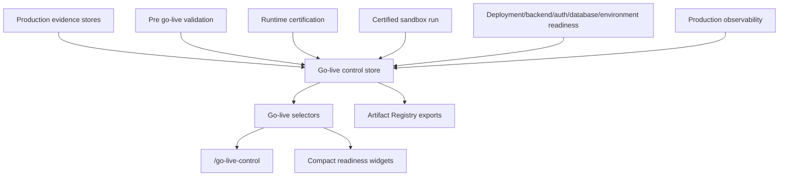

# Go-Live Control Architecture

Sprint 9H adds a final release approval and go-live control layer on top of the existing production readiness stack. The layer does not replace any gate. It aggregates the latest readiness evidence and decides whether a release candidate is `GO`, `NO_GO`, `BLOCKED`, or `WARNING`.

## Runtime Flow

## Decision Model

- `GO`: release is approved, released, or all final blockers are resolved with approval.
- `NO_GO`: release is explicitly rejected or rolled back.
- `BLOCKED`: one or more required gates, evidence items, release window, approver, or rollback plan is missing.
- `WARNING`: no critical blocker remains, but non-critical warnings still need attention.

## Required Gates

The matrix includes production readiness, deployment config, runtime certification, certified sandbox run, backend readiness, database readiness, auth readiness, environment readiness, production config evidence, production observability, and pre-go-live validation.

## Release Controls

The control page supports creating a release candidate, refreshing readiness, setting a release window, verifying rollback plan, requesting approval, approving go-live, rejecting go-live, marking released, triggering rollback, exporting the go-live pack, and copying a release summary. Disabled actions expose clear reasons through `data-disabled-reason` and button titles.

## Artifact Exports

Exports are registered through the Artifact Registry:

- `go-live-final-verdict.md`
- `go-live-control-report.md`
- `go-live-readiness-matrix.json`
- `go-live-blockers.json`
- `go-live-approval-record.md`
- `go-live-release-checklist.md`
- `go-live-rollback-plan.md`
- `go-live-pack.zip.md`
