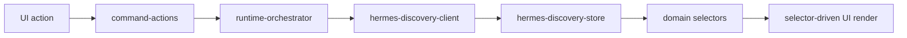

# Hermes Discovery Architecture

## Purpose

The Hermes discovery layer exposes runtime status, capabilities, models, and tools through the existing GrowthOS runtime boundary. UI components do not call Hermes clients directly.

## Flow

## Runtime Modes

| Mode | Behavior |
|---|---|
| mock | Returns deterministic Hermes discovery data with online status, mock models, tools, and capabilities. |
| sandbox with missing config | Does not crash. Stores `missing_config`, keeps mock run readiness available, and reports warnings. |
| sandbox with config | Calls defensive Hermes discovery endpoints and normalizes responses into internal discovery types. |
| sandbox offline | Stores `offline` or `degraded` with warnings; UI continues to support mock fallback. |

## Discovery Data

`HermesDiscoveryResult` includes:
- `status`
- `mode`
- `baseUrl`
- `version`
- `capabilities`
- `models`
- `tools`
- `warnings`
- `checkedAt`

External responses are treated as unknown data and normalized at the discovery client boundary.

## Store Boundary

`src/runtime-store/hermes-discovery-store.ts` persists discovery data in `sessionStorage` under a dedicated key. Runtime readiness reads from this store, so route navigation preserves the last known Hermes discovery result.

## Selectors

The UI consumes discovery through:
- `selectHermesDiscovery()`
- `selectHermesStatus()`
- `selectHermesTools()`
- `selectHermesModels()`
- `selectHermesCapabilities()`
- `selectRuntimeReadiness()`

## UI Wiring

Current route wiring is intentionally narrow:
- `/runs/demo-run` displays Hermes runtime discovery status, model, mode, enabled tools, and a refresh action.
- `/integrations` receives Hermes runtime status through the integration hub view model.

No React component imports `hermes-client.ts` or `paperclip-client.ts` directly.

## Readiness Rules

| Condition | Real run readiness | Mock run readiness |
|---|---:|---:|
| Hermes online | true | true |
| Hermes degraded | true | true |
| Missing config | false | true |
| Offline | false | true |
| Unknown | false | true |

Mock fallback remains available in every mode.
