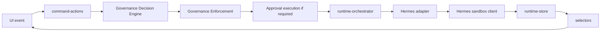

# Hermes Sandbox Runtime Architecture

## Purpose

Sprint 8A connects the GrowthOS runtime adapter layer to an optional Hermes Sandbox Runtime endpoint while keeping mock mode as the default and preserving enterprise governance enforcement.

## Runtime Flow

React components do not import Hermes or Paperclip clients. Runtime execution remains routed through `runtime-orchestrator`.

## Environment

| Variable | Purpose |
|---|---|
| `HERMES_RUNTIME_MODE` | `mock` or `sandbox`. New sandbox runtime switch. |
| `HERMES_SANDBOX_BASE_URL` | Hermes Sandbox Runtime base URL. |
| `HERMES_SANDBOX_API_KEY` | Sandbox API token. |
| `HERMES_SANDBOX_WORKSPACE_ID` | Workspace identifier sent as `X-Workspace-Id`. |
| `HERMES_SANDBOX_TIMEOUT_MS` | Optional request timeout. Defaults to 15000ms. |

Legacy `VITE_RUNTIME_MODE`, `VITE_HERMES_BASE_URL`, `VITE_HERMES_API_KEY`, and `VITE_RUNTIME_TIMEOUT_MS` remain supported for existing smoke tests and local demos.

## Fallback Behavior

If sandbox mode is requested but required sandbox config is missing, the Hermes config resolves to mock mode with degraded readiness. The UI does not crash. Runtime readiness reports:

- mode: `mock`
- requestedMode: `sandbox`
- fallbackReason: sandbox config missing
- currentRunSource: `mock`

Warnings do not block mock fallback. Enterprise governance blockers still block execution before any real Hermes call.

## Sandbox Client

`src/integrations/hermes/hermes-sandbox-client.ts` exposes:

- `checkHermesHealth()`
- `discoverHermesRuntime()`
- `startHermesSandboxRun()`
- `pollHermesSandboxRun()`
- `cancelHermesSandboxRun()`
- `streamHermesSandboxEvents()`

All methods normalize unknown responses into GrowthOS runtime contracts and return degraded health instead of crashing for unreachable sandbox health checks.

## Lifecycle Mapping

| Hermes | GrowthOS |
|---|---|
| created | CREATED |
| queued | QUEUED |
| running | RUNNING |
| waiting_for_approval | WAITING_APPROVAL |
| completed | COMPLETED |
| failed | FAILED |
| cancelled | REJECTED |

Tool calls are normalized into runtime tool call rows. Artifact-like outputs are normalized into GrowthOS artifacts with `source: hermes`.

## Governance Preflight

Before a configured real sandbox start, `assertEnterpriseGovernancePreflight()` runs the enterprise governance exit gate.

- blocker count > 0: no sandbox call, enforcement rejection is recorded, runtime event is appended.
- warnings only: sandbox can proceed.
- sandbox offline/missing config: mock fallback is allowed and readiness remains warning/degraded.

## UI Surface

Existing layouts show compact runtime metadata without changing AppShell or bbox contracts:

- `/runs/demo-run`: runtime mode, Hermes health, last sandbox sync, fallback reason, run source.
- `/tickets/demo-ticket`: runtime mode and Hermes health in the existing execution status card.
- `/approvals`: runtime source in the existing approval detail grid.
- `/governance-readiness`: runtime readiness check reflects mock fallback vs sandbox readiness.

## Known Limitations

- Real streaming uses a defensive `/runs/:id/events` shape until Hermes publishes a final streaming contract.
- Sandbox execution is optional and requires env configuration.
- Paperclip remains behind its existing adapter and mock fallback in this sprint.

## Production Adapter Plan

Next production work should finalize the Hermes HTTP schema, replace defensive endpoint assumptions with versioned contracts, and add authenticated backend-mediated token handling rather than browser-exposed sandbox credentials.
