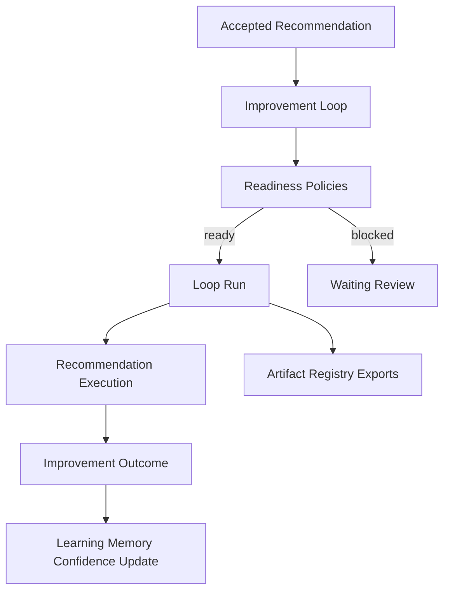

# Improvement Loop Architecture

## Purpose

The autonomous improvement loop scheduler turns accepted learning recommendations into scheduled, reviewable execution loops. It sits above recommendation execution and improvement outcome verification, so future agent improvements can run repeatedly with readiness checks and measurable impact.

## Flow

## Runtime Files

| File | Responsibility |
|---|---|
| `src/runtime/improvement-loop.ts` | Domain types, statuses, trigger model, summaries |
| `src/runtime/improvement-loop-store.ts` | sessionStorage persistence, lifecycle actions, selectors, exports |
| `src/domain/selectors.ts` | UI selector facade for loop state |
| `src/pages/EvaluationPage.tsx` | Full loop panel and compact widgets |

## Readiness Rules

| Rule | Behavior |
|---|---|
| Rejected recommendation | Cannot create a loop |
| Confidence below threshold | Blocks loop start |
| Governance warning trigger | Blocks loop start and moves to review |
| High-risk recommendation | Requires approval-style review hold |
| Failed loop run | Lowers recommendation confidence |
| Completed loop run | Completes recommendation execution and verifies improvement outcome |

## Persistence

The store persists loops, runs, schedules, and outcomes under `uikigai-improvement-loop-v1` in `sessionStorage`. IDs are deterministic by recommendation ID, preventing duplicate loops for the same recommendation.

## Artifact Exports

The loop exports are registered through Artifact Registry:

- `improvement-loop.json`
- `improvement-loop-summary.md`
- `improvement-loop-runs.json`
- `improvement-loop-outcome.md`
- `learning-loop-report.md`

## UI Surfaces

The main panel is on `/evaluation`. Compact widgets are available to `/runs/demo-run`, `/execution-timeline`, `/execution-graph`, `/artifacts`, `/evaluation`, and `/agents/demo-agent`.
