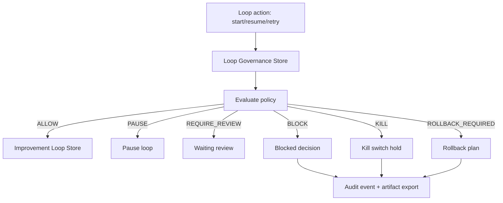

# Improvement Loop Governance Architecture

## Purpose

Autonomous improvement loops now have a mandatory governance layer that prevents runaway execution, repeated failure, excessive cost/risk, low-confidence recommendations, and manual kill-switch bypass.

## Flow

## Governance Decisions

- `ALLOW`
- `PAUSE`
- `REQUIRE_REVIEW`
- `BLOCK`
- `KILL`
- `ROLLBACK_REQUIRED`

## Block Reasons

- `max_attempts_exceeded`
- `confidence_too_low`
- `repeated_failure`
- `cost_limit_exceeded`
- `risk_too_high`
- `governance_blocker`
- `approval_required`
- `regression_detected`
- `manual_kill_switch`
- `missing_evidence`

## Kill Switch

The global kill switch:

- blocks new loop starts
- pauses currently running/scheduled/waiting-review loops
- marks active loop runs as paused
- records audit events
- exports a kill-switch report through Artifact Registry

## Rollback

Rollback plans are created when governance detects regression or when an operator requests rollback from `/evaluation`. Rollback plans preserve the execution evidence and require manual review before another loop attempt.

## Persistence

Governance state persists in `sessionStorage` under `uikigai-improvement-loop-governance-v1`.

## UI

`/evaluation` includes:

- governance status
- blockers panel
- kill-switch controls
- rollback required panel
- audit timeline

Compact governance widgets are wired into:

- `/runs/demo-run`
- `/execution-timeline`
- `/execution-graph`
- `/artifacts`
- `/agents/demo-agent`
