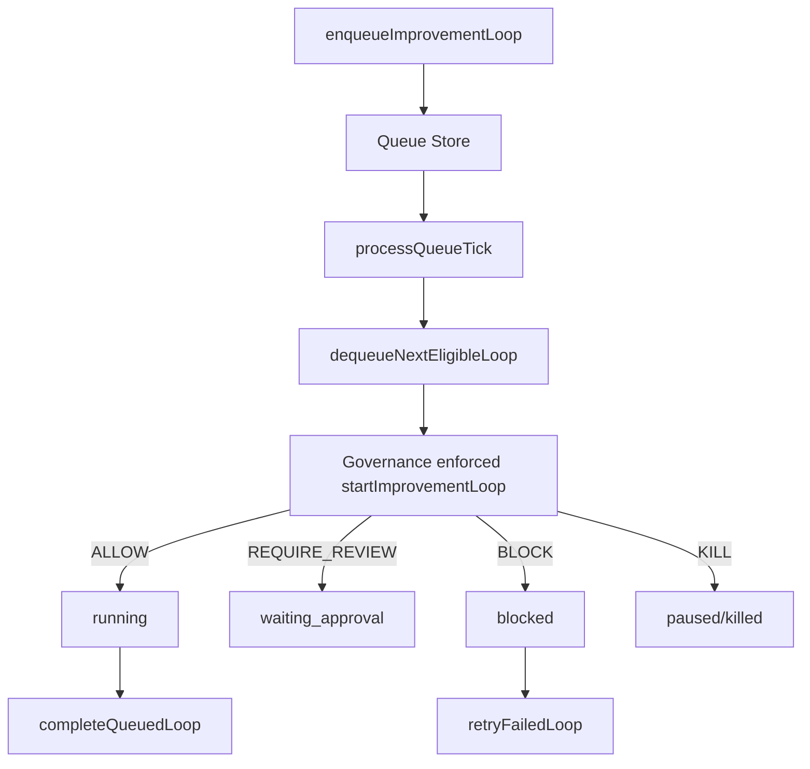

# Improvement Loop Queue Architecture

## Purpose

The improvement loop queue runtime schedules autonomous loops, applies governance before execution, enforces concurrency, supports retry/backoff, and records queue audit evidence.

## Flow

## Statuses

- `queued`
- `scheduled`
- `waiting_governance`
- `waiting_approval`
- `running`
- `retrying`
- `paused`
- `blocked`
- `completed`
- `failed`
- `cancelled`
- `killed`

## Rules

- Global kill switch blocks queue processing.
- Governance must allow execution before a queue item runs.
- `REQUIRE_REVIEW` moves the item to `waiting_approval`.
- `BLOCK` and `ROLLBACK_REQUIRED` move the item to `blocked`.
- Max concurrency is enforced before start.
- Retry policy respects max retries and backoff.
- Scheduled items only run inside their allowed schedule window.

## Persistence

Queue items, audit events, retry attempts, schedule windows, concurrency, and last processed tick persist in `sessionStorage` under `uikigai-improvement-loop-queue-v1`.

## Artifact Exports

- `improvement-loop-queue.json`
- `improvement-loop-queue-summary.md`
- `improvement-loop-queue-audit.md`
- `blocked-queue-items.json`
- `retry-policy-report.md`
- `scheduled-loop-report.md`
