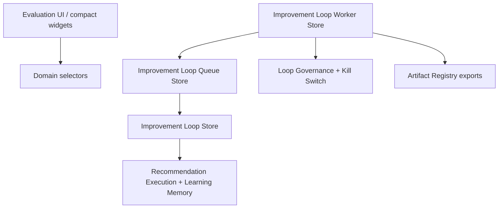

# Improvement Loop Worker Architecture

## Purpose

The autonomous improvement loop worker is the runner that polls the improvement loop queue and executes eligible work through the existing governance and queue runtime.

## Flow

## Worker Lifecycle

- `idle`: worker exists but no eligible work is active.
- `polling`: worker is looking for the next eligible queue item.
- `executing`: worker started a queue item through the queue runtime.
- `waiting_governance`: governance prevented execution.
- `waiting_approval`: governance requires review before execution.
- `retrying`: failed work was scheduled for retry.
- `paused`: user, kill switch, or stale heartbeat paused execution.
- `stopped`: worker was explicitly stopped.
- `failed`: retry policy was exhausted or worker failure was terminal.

## Runtime Responsibilities

- Read the next eligible queue item.
- Check kill switch before each execution attempt.
- Respect queue concurrency and schedule windows.
- Delegate execution to queue and improvement loop stores.
- Record heartbeat and tick history.
- Detect stale worker heartbeat and pause recovery.
- Record execution results.
- Complete or fail queue items.
- Register worker status and recovery artifacts.

## Persistence

Worker state is persisted in `sessionStorage` under `uikigai-improvement-loop-worker-v1`.

Persisted state includes:

- workers
- active worker id
- heartbeats
- tick history
- execution results
- stale worker warnings

## Selector Boundary

UI reads worker state through selectors only:

- `selectImprovementLoopWorkerStatus`
- `selectActiveWorker`
- `selectWorkerHeartbeat`
- `selectWorkerTickHistory`
- `selectWorkerExecutionSummary`
- `selectStaleWorkerWarnings`
- `selectWorkerBlockedReason`

## Exports

Worker artifacts are registered through the Artifact Registry:

- `improvement-worker-status.json`
- `improvement-worker-summary.md`
- `improvement-worker-tick-log.json`
- `improvement-worker-failure-report.md`
- `improvement-worker-recovery-report.md`
