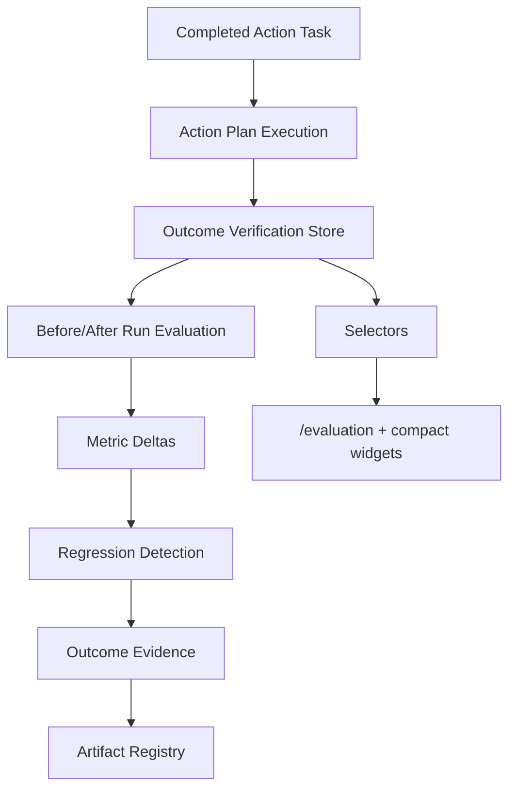

# Improvement Outcome Architecture

## Purpose

Improvement Outcome Verification proves whether completed improvement work actually moved run quality. It compares before/after run evaluations, calculates metric deltas, detects regressions, and registers evidence exports.

## Flow

## Domain

| Model | Purpose |
|---|---|
| `ImprovementOutcome` | Verification record for an action execution or task execution |
| `ImprovementComparison` | Before/after run evaluation comparison |
| `ImprovementMetricDelta` | Per-dimension score delta |
| `OutcomeEvidence` | Evidence generated by verification |
| `RegressionFinding` | Detected score regression |

## Statuses

- `unverified`
- `improved`
- `unchanged`
- `regressed`
- `inconclusive`

## Rules

- Completed tasks require outcome verification.
- Improved means overall score or target metric increased.
- Regressed means a critical dimension drops below threshold or falls sharply.
- Inconclusive means before/after data is missing.
- Cost optimization maps to `cost_efficiency`.
- Artifact quality maps to `artifact_quality`.
- Governance improvements map to `governance_compliance`.
- Replay integrity maps to `replay_integrity`.

## Persistence

`src/runtime/improvement-outcome-store.ts` persists outcomes in `sessionStorage` under `uikigai-improvement-outcome-v1`. Outcome IDs are deterministic by action execution or action task execution, preventing duplicates.

## Selectors

`src/domain/selectors.ts` exposes:

- `selectImprovementOutcomeByAction`
- `selectOutcomesByRun`
- `selectWorkspaceOutcomeSummary`
- `selectImprovedOutcomes`
- `selectRegressedOutcomes`
- `selectInconclusiveOutcomes`
- `selectMetricDeltas`
- `selectOutcomeEvidence`

## Artifact Exports

- `improvement-outcome.json`
- `improvement-outcome-summary.md`
- `metric-delta-report.json`
- `regression-findings.md`
- `outcome-evidence.md`
