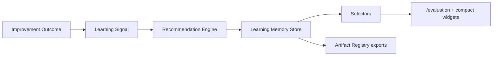

# Learning Memory Architecture

Sprint 8K adds a lightweight learning memory layer above Improvement Outcome Verification. It converts verified outcomes into durable learning signals, turns those signals into reusable recommendations, and exposes selector-driven widgets for future runs, agents, workflows, and governance review.

## Runtime Files

| File | Purpose |
|---|---|
| `src/runtime/learning-memory.ts` | Domain types, IDs, context keys, priority helpers |
| `src/runtime/recommendation-engine.ts` | Signal-to-recommendation mapping and confidence calculation |
| `src/runtime/learning-memory-store.ts` | Session persistence, duplicate prevention, selectors backend, exports |

## Signal Model

Signals capture reusable learning from an outcome:

- outcome status: improved, regressed, unchanged, inconclusive
- run, agent, workflow context
- target evaluation dimensions
- outcome evidence IDs
- signal strength

Duplicate signals are prevented by deterministic `learning-signal-${outcomeId}` IDs.

## Recommendation Rules

| Outcome | Recommendation behavior |
|---|---|
| Improved | Increase confidence and suggest reusing the proven workflow/tool/pattern |
| Regressed | Create avoid/change recommendations and raise priority |
| Inconclusive | Recommend rerun with stronger constraints and more evidence |
| High cost | Recommend cost reduction |
| Governance regression | Recommend approval or policy action |
| Artifact quality regression | Recommend artifact validation/checklist action |

Duplicate recommendations are prevented by type plus run/agent/workflow/dimension context.

## Selector Surface

- `selectLearningSignals`
- `selectRecommendations`
- `selectRecommendationsByRun`
- `selectRecommendationsByAgent`
- `selectRecommendationsByWorkflow`
- `selectTopRecommendations`
- `selectAcceptedRecommendations`
- `selectRejectedRecommendations`
- `selectRecommendationConfidence`
- `selectLearningMemorySummary`

## UI Integration

`/evaluation` shows the full learning memory panel, top recommendations, evidence, confidence, accept/reject controls, and signal history.

Compact widgets are attached to:

- `/runs/demo-run`
- `/execution-timeline`
- `/execution-graph`
- `/artifacts`
- `/evaluation`
- `/agents/demo-agent`

## Artifact Exports

Learning memory registers these exports through Artifact Registry:

- `learning-memory.json`
- `recommendations.json`
- `recommendation-summary.md`
- `recommendation-evidence.md`
- `learning-signal-report.json`
