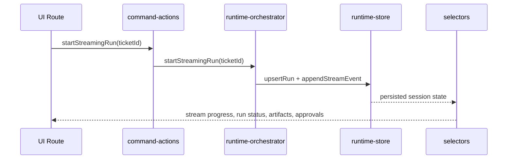

# Live Run Streaming Architecture

## Purpose

Live run streaming adds deterministic Hermes/Paperclip execution ticks on top of the existing runtime adapter and persistence layers. It keeps mock and sandbox fallback behavior intact while giving the Run Console progressive events instead of a single final state.

## Flow

## Stream Event Contract

`RunStreamEvent` contains:

- `id`
- `runId`
- `sequence`
- `type`
- `message`
- `timestamp`
- optional `payload`

Supported event types:

- `run.queued`
- `run.started`
- `tool.started`
- `tool.progress`
- `tool.completed`
- `artifact.created`
- `approval.requested`
- `run.completed`
- `run.failed`

## Runtime Store

`src/runtime-store/stream-store.ts` persists stream state in the existing runtime session storage record:

- `appendStreamEvent(runId, event)`
- `getStreamEvents(runId)`
- `clearStream(runId)`
- `markStreamComplete(runId)`
- `isStreamComplete(runId)`

Stream state is stored with runs, approvals, artifacts, and runtime events, so route navigation and page reloads preserve the stream timeline.

## Orchestrator API

`runtime-orchestrator.ts` is the only streaming entry point:

- `startStreamingRun(ticketId)`
- `nextStreamTick(runId)`
- `completeStreamingRun(runId)`
- `failStreamingRun(runId)`

Mock mode generates deterministic ticks. Sandbox mode may still simulate streaming until Hermes exposes a streaming endpoint. Missing sandbox config continues to fall back safely through the existing adapter resolution.

## UI Wiring

React components do not import Hermes or Paperclip clients. The routes read stream state through selectors and existing hooks:

- `/runs/demo-run`: live timeline, current step, tool calls, logs, artifacts, approval/final state.
- `/tickets/demo-ticket`: start streaming action, stream status, progress summary.
- `/approvals`: stream-created approval appears through runtime approvals.

## Persistence Rule

Every stream tick writes both:

- a typed stream event for ordered live timeline state
- a runtime event for existing activity/audit timeline behavior

