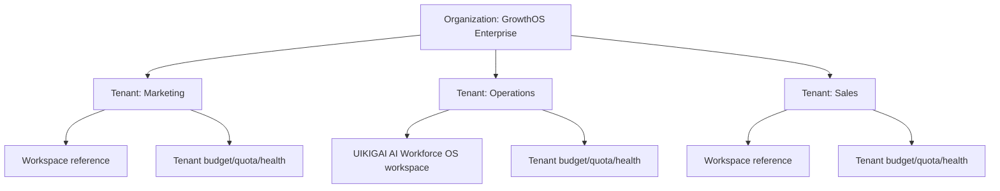

# Organization Governance Architecture

## Purpose

Organization governance introduces an enterprise hierarchy above workspace governance. It is a frontend mock/runtime foundation only: no authentication, RBAC, backend APIs, billing provider, or tenant enforcement is implemented in Sprint 7K.

## Hierarchy

## Domain Models

The domain lives in `src/runtime/organization-governance.ts`.

| Model | Purpose |
|---|---|
| `Organization` | Enterprise-level owner of tenants. |
| `Tenant` | Business unit scoped under an organization. |
| `WorkspaceReference` | Links a workspace to tenant and organization. |
| `TenantBudget` | Tenant monthly limit, spend, and remaining budget. |
| `TenantQuota` | Tenant run, token, and artifact quota usage. |
| `TenantHealth` | Budget, quota, workspace, and overall tenant health. |
| `OrganizationHealth` | Aggregated tenant/workspace count and health. |

## Store

The store lives in `src/runtime/organization-store.ts`.

Persisted sessionStorage key:

`uikigai-organization-governance-v1`

Persisted state:
- organizations
- tenants
- workspace references
- tenant budgets
- tenant quotas
- tenant health
- organization health

Selector reads remain pure. `generateOrganizationGovernance()` is the explicit write path for refreshing persisted reports.

## Evaluation Rules

Budget:
- `OK`: usage at or below 90% of monthly limit.
- `WARNING`: usage greater than 90%.
- `CRITICAL`: spend exceeds monthly limit.

Quota:
- `OK`: usage at or below 90%.
- `WARNING`: usage greater than 90%.
- `CRITICAL`: usage exceeds limit.

Organization health aggregates the highest tenant budget, quota, and overall severity.

## Selectors

Selectors are exposed from `src/domain/selectors.ts`:

- `selectOrganization`
- `selectOrganizations`
- `selectTenant`
- `selectTenants`
- `selectTenantBudget`
- `selectTenantQuota`
- `selectTenantHealth`
- `selectOrganizationHealth`
- `selectWorkspaceCount`
- `selectTenantCount`
- `selectOrganizationSummary`
- `selectOrganizationGovernanceViewModel`

## Dashboard

`/organization` is a read-only dashboard showing:
- Organization overview
- Tenant count
- Workspace count
- Budget overview
- Quota/health overview
- Warnings
- Top cost tenants
- Top usage tenants

## Existing Screen Integration

Summaries are selector-driven and wired into:
- `/workspace`
- `/cost`
- `/runs/demo-run`
- `/approvals`

## Artifacts

`exportOrganizationGovernanceArtifacts()` uses the existing Artifact Viewer path.

Generated artifacts:
- `organization-summary.md`
- `tenant-health-report.md`
- `organization-governance.json`

## Future Integration

Planned extensions:
- RBAC role inheritance from organization to tenant to workspace.
- Policy inheritance across organization, tenant, workspace, and run.
- Backend tenant APIs and server-side enforcement.
- Organization-level quota and billing provider reconciliation.
