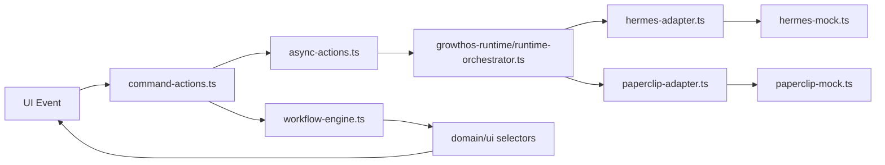

# Paperclip + Hermes Integration Architecture

## Purpose
Sprint 6A adds a frontend-safe integration boundary for Paperclip and Hermes without calling external services from React components. The current runtime is mock-only, but the contracts are shaped so a remote adapter can replace the mock client later.

## Boundary
UI components never call Hermes or Paperclip directly.

## Runtime Contracts
Hermes:
- `HermesTask`
- `HermesExecution`
- `HermesToolCall`

Paperclip:
- `PaperclipArtifact`

GrowthOS Runtime:
- `HumanApprovalGate`
- `RuntimeActionPlan`
- `RuntimeRunCommand`

## Mappings
| Source | Target | File |
|---|---|---|
| Ticket | HermesTask | `ticket-to-task-mapper.ts` |
| Run | HermesExecution | `run-event-mapper.ts` |
| ToolCall | HermesToolCall | `run-event-mapper.ts` |
| Artifact | PaperclipArtifact | `run-event-mapper.ts` |
| Approval | HumanApprovalGate | `run-event-mapper.ts` |

## Actions
| Action | Behavior |
|---|---|
| `startAgentRun(ticketId)` | Optimistically starts a Hermes run, creates runtime tool calls, creates a Paperclip artifact, and opens a human approval gate. |
| `pauseAgentRun(runId)` | Optimistically pauses a run and commits through Hermes adapter. |
| `resumeAgentRun(runId)` | Optimistically resumes a run and commits through Hermes adapter. |
| `retryAgentRun(runId)` | Optimistically retries a run and commits through Hermes adapter. |
| `cancelAgentRun(runId)` | Optimistically cancels a run and commits through Hermes adapter. |
| `approveRunAction(approvalId)` | Routes approval success through runtime adapter. |
| `rejectRunAction(approvalId)` | Routes approval rejection through runtime adapter. |

## Mock Mode
Sprint 6A uses mock adapters only:
- `createMockHermesClient()` simulates task start, run commands, tool calls, logs, approval required, and failure injection.
- `createMockPaperclipClient()` simulates artifact creation.

Failure injection:
- Set `sessionStorage["uikigai-runtime-fail-next-command"]` to `startAgentRun`, `pauseAgentRun`, `resumeAgentRun`, `retryAgentRun`, or `cancelAgentRun`.

## Route Scope
Sprint 6A wires the runtime only to:
- `/tickets/demo-ticket`
- `/runs/demo-run`
- `/approvals`

All other screens continue to use the shared demo data and selectors.

## State Reconciliation
Runtime actions return a `RuntimeActionPlan`:
1. `applyOptimistic(data)` updates workflow data immediately.
2. `commit()` calls the mock adapter asynchronously.
3. `runWorkflowCommand()` reconciles success/failure and rolls back on adapter failure.

Workflow domain data is persisted in `sessionStorage` so runtime-created run/artifact/approval state survives route loads in the current browser session. Mutation status and event rows remain in memory and are not persisted.
