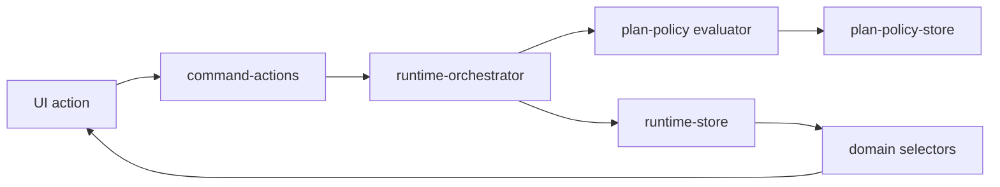

# Plan Execution Policy Architecture

## Purpose

The plan execution policy layer evaluates `RunPlan` and `RunPlanStep` objects before runtime execution. It keeps policy decisions inside the GrowthOS runtime boundary:

React components do not import Hermes or Paperclip clients. They read policy state only through selectors.

## Policy Model

`PlanPolicy` defines a policy rule with:

- `severity`: `info`, `warning`, or `blocking`
- `appliesTo`: `plan`, `step`, `tool`, `artifact`, or `approval`
- `condition`: human-readable condition expression
- `message`: operator-facing failure/warning text

`PlanExecutionPolicyReport` persists:

- `status`: `allowed`, `warning`, or `blocked`
- `results`
- `blockingReasons`
- `warnings`
- `approvalRequiredSteps`
- `evaluatedAt`

Reports are stored in `sessionStorage` by `src/runtime-store/plan-policy-store.ts`.

## Default Policies

| Policy | Severity | Behavior |
|---|---|---|
| `missing_capability_blocks_execution` | blocking | Prevents starting plans with missing required capabilities. |
| `incompatible_tool_model_blocks_step` | blocking | Prevents steps with incompatible discovered tool/model mappings. |
| `approval_required_for_artifact_generation` | warning | Requires artifact steps to open an approval gate. |
| `approval_required_for_external_action` | warning | Requires external/deployment execution steps to open an approval gate. |
| `deployment_capability_required_for_deployment` | blocking | Blocks deployment workflows without deployment capability. |
| `unknown_tool_requires_review` | warning | Records review warning for tools not in the registry. |
| `high_risk_tool_requires_approval` | warning | Requires approval for risky tools or approval/governance tools. |

## Start Guard

`startRunFromPlan(planId)` evaluates and persists a policy report before runtime starts:

1. Missing plan or blocked plan throws.
2. Blocking policy report throws and records a failed runtime event.
3. Allowed/warning report may start.
4. Approval-required steps create runtime approvals.
5. Runs with approval gates move to `WAITING_APPROVAL`.

## Selector Surface

Selectors expose policy state without leaking store implementation:

- `selectPolicyReport(planId)`
- `selectBlockingReasons(planId)`
- `selectPlanWarnings(planId)`
- `selectCanStartPlan(planId)`

Ticket detail, Run Console, and Approval Center render policy status from these selectors.
