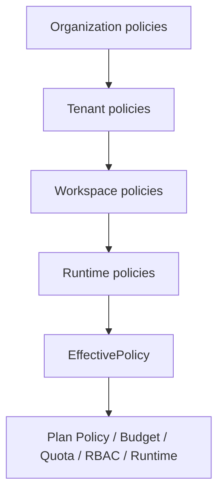

# Policy Inheritance Architecture

## Purpose

Sprint 7N adds a policy inheritance engine across organization, tenant, workspace, and runtime execution scopes. It does not replace existing plan policy, budget, quota, RBAC, or audit engines. It provides an effective policy lookup layer that those engines can consult before their existing evaluation logic runs.

## Hierarchy

## Override Rules

| Rule | Behavior |
|---|---|
| Organization policy is root | It supplies the default value for every matching category/key. |
| Tenant override | Allowed unless the organization policy is locked. |
| Workspace override | Allowed unless the active tenant or organization policy is locked. |
| Runtime override | Allowed only when the active workspace policy has `runtimeOverride: true`. |
| Locked parent | Blocks a child override and creates a `PolicyConflict`. |
| Same-scope same-priority mismatch | Creates a `PolicyConflict`. |

## Policy Model

`PolicyRule` includes:

- `scope`, `scopeId`
- `category`, `key`, `value`
- `priority`
- `locked`
- `runtimeOverride`
- `source`
- timestamps

`EffectivePolicy` includes source trace:

- `organizationPolicyId`
- `tenantPolicyId`
- `workspacePolicyId`
- `runtimePolicyId`

## Integration Points

| Engine | Effective Policy Used |
|---|---|
| Plan Policy | `approval.artifactRequiresApproval` |
| Execution Budget | `budget.maxCost` |
| Usage Quota | `quota.maxToolCalls` |
| RBAC Decision Flow | `rbac.auditRequired` |
| Authorization Audit | Respects RBAC audit policy through RBAC store |
| Runtime Orchestrator | Exports policy inheritance artifacts |

## Selectors

- `selectPolicyInheritanceTree`
- `selectEffectivePolicies`
- `selectEffectivePolicyByCategory`
- `selectPolicyConflicts`
- `selectLockedPolicies`
- `selectPolicyOverrides`
- `selectPolicyInheritanceReport`
- `selectPolicyTraceForRuntime`
- `selectPolicyWarnings`

## UI

`/policies` renders a read-only dashboard with:

- policy inheritance tree
- organization, tenant, workspace, and runtime policies
- effective policies
- locked policies
- overrides
- conflicts
- warnings

Compact policy summaries are surfaced through existing view models for organization, workspace, ticket, run, approval, and access dashboards.

## Artifacts

The runtime orchestrator exports:

- `policy-inheritance-summary.md`
- `effective-policy-report.md`
- `policy-conflicts.json`
- `policy-trace-report.md`

## Future Backend Plan

Current persistence is sessionStorage. A future backend can store policy rules and immutable conflict reports while preserving the selector and artifact interfaces.
