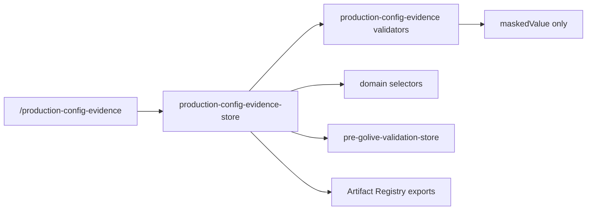

# Production Config Evidence Binder Architecture

## Purpose

The Production Config Evidence Binder is the proof layer between local/mock readiness checks and production go-live gates. It collects production configuration evidence, masks values at ingestion, verifies evidence by category, and exports redacted evidence packs through the Artifact Registry.

It does not store raw secrets and does not manually remove blockers. A blocker is considered resolved only when a related evidence category is verified and not expired.

## Evidence Categories

- backend_endpoint
- database_config
- auth_config
- secret_presence
- secret_owner
- secret_scope
- secret_rotation
- schema_version
- migration_status
- rbac_binding
- tenant_workspace_binding
- production_endpoint_reachability

## Data Flow

## Validation Rules

Production endpoint evidence rejects localhost, mock, and demo endpoints. Database evidence requires a provider and masked connection proof. Auth evidence requires provider, issuer, audience, token mode, and session mode. Secret evidence proves presence without value disclosure, and owner, scope, rotation, schema, migration, RBAC, and tenant/workspace binding evidence are required before the evidence gate can pass.

## Gate Integration

Pre-Go-Live Validation includes a dedicated `production-config-evidence` gate. Existing backend, database, auth, and environment gates can reduce related blockers only through verified, non-expired evidence. Missing, rejected, or expired evidence keeps the gate blocked.

## Redaction

Raw values are not persisted. The store records only `maskedValue`, evidence metadata, status, warnings, and verification fields. Metadata keys that look secret-bearing are redacted before storage.

## Exports

The binder registers:

- production-config-evidence.json
- production-config-evidence-summary.md
- production-evidence-blockers.json
- production-evidence-redaction-report.md
- production-go-live-evidence-pack.md
- production-config-final-verdict.md
