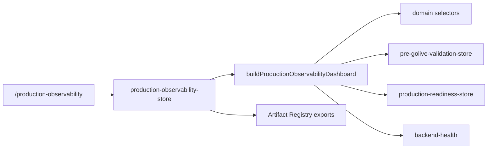

# Production Observability & Incident Readiness Architecture

## Purpose

Production Observability is the operational proof layer for go-live. It records evidence for health monitoring, logging, audit trails, alerting, incident ownership, escalation, rollback runbooks, SLO/SLA thresholds, RTO/RPO targets, and production dashboard availability.

The layer does not call production services directly from UI components. UI actions write evidence through `production-observability-store`, selectors expose derived readiness, and Pre-Go-Live / Production Readiness consume the verdict.

## Data Flow

## Required Evidence

- health_monitor
- logging
- audit_logging
- alert_channel
- incident_owner
- escalation_policy
- runbook
- slo_sla
- rto_rpo
- dashboard

All required evidence must be verified before the observability verdict can become `READY`. Missing or failed critical evidence keeps the verdict `BLOCKED`.

## UI Actions

- `addMonitorEvidence`
- `verifyMonitorEvidence`
- `rejectMonitorEvidence`
- `addAlertChannel`
- `testAlertChannel`
- `addIncidentOwner`
- `verifyRunbook`
- `exportObservabilityPack`

Each action mutates runtime state visibly. Disabled actions include an explicit disabled reason.

## Gate Integration

Pre-Go-Live Validation includes a dedicated `production-observability` gate. Production Readiness now adds a blocker while observability is blocked, and backend health reports include an observability readiness summary for operational context.

## Artifact Exports

The store registers:

- production-observability-report.md
- production-observability.json
- production-alert-readiness.md
- production-incident-runbook.md
- production-slo-sla-report.md
- production-rto-rpo-report.md
- production-observability-blockers.json
