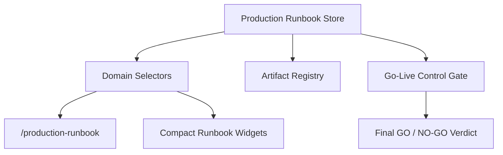

# Production Runbook Architecture

Sprint 9I adds an operator handoff layer for production go-live. It creates the operational runbook, checklist, escalation matrix, rollback procedure, monitoring checklist, support window, incident response procedure, and handoff acceptance state.

## Purpose

The runbook layer does not approve production by itself and does not bypass Go-Live Control. It feeds Go-Live Control as a required gate. Production remains blocked until the runbook is ready or approved, operator handoff is accepted, rollback and monitoring procedures exist, owners are assigned, and support coverage is scheduled.

## Flow

## Runbook Sections

- Deployment checklist
- Go-live checklist
- Post-release monitoring checklist
- Incident response procedure
- Rollback procedure
- Escalation matrix
- Support contacts
- SLO/SLA/RTO/RPO summary
- Known risks
- Manual verification steps

## Statuses

Runbook status: `draft`, `incomplete`, `ready`, `approved`, `expired`.

Handoff status: `pending`, `ready`, `accepted`, `rejected`.

The Go-Live Control gate requires runbook status `ready` or `approved`, handoff `accepted`, rollback readiness, monitoring readiness, escalation owner, incident owner, and support window.

## Exports

- `production-runbook.md`
- `operator-handoff-pack.md`
- `incident-response-runbook.md`
- `rollback-procedure.md`
- `support-escalation-matrix.md`
- `post-release-monitoring-checklist.md`
- `go-live-operator-summary.md`
