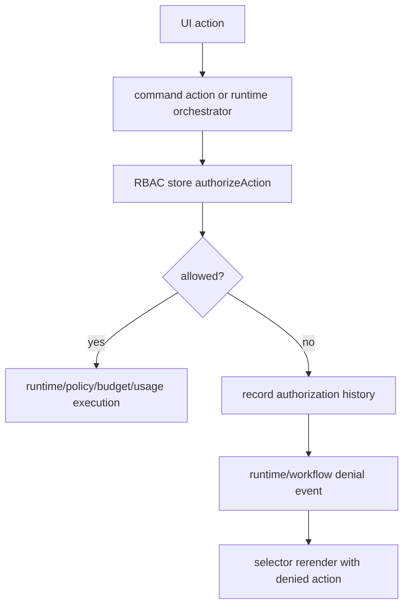

# RBAC Architecture

## Purpose

Sprint 7L adds a selector-driven Role-Based Access Control layer across runtime execution, planning, governance, artifacts, and reporting. UI components do not import Hermes/Paperclip clients and do not own authorization logic.

## Role Hierarchy

| Role | Intent |
|---|---|
| OrganizationOwner | Full organization, tenant, workspace, runtime, budget, policy, artifact, and deployment authority. |
| OrganizationAdmin | Cross-tenant governance and operational administration without owner-level organization edit. |
| TenantAdmin | Tenant operations, workspace governance, budget override, and runtime approval. |
| WorkspaceAdmin | Workspace operations, run execution, approval, artifact export, and governance visibility. |
| Operator | Day-to-day run execution and cancellation with read access to governance and cost. |
| Reviewer | Approval and artifact review with read access to governance and cost. |
| Viewer | Read-only access to dashboards, artifacts, analytics, and governance. |

## Permission Model

Permissions are defined in `src/runtime/rbac.ts` and persisted through `src/runtime/rbac-store.ts`.

Key permission families:

- Organization and tenant: `organization.view`, `organization.edit`, `tenant.view`, `tenant.edit`.
- Workspace: `workspace.view`, `workspace.edit`.
- Budget and policy: `budget.view`, `budget.edit`, `policy.view`, `policy.edit`.
- Runtime: `run.create`, `run.start`, `run.cancel`, `run.approve`, `deployment.approve`.
- Artifact, cost, analytics, governance: `artifact.view`, `artifact.export`, `cost.view`, `analytics.view`, `governance.view`.

## Authorization Flow

## Enforcement Points

Current protected operations:

- `approveRunPlan(planId)`
- `startRunFromPlan(planId)`
- `startAgentRun(ticketId)` from command actions
- `startStreamingRun(ticketId)` from command actions
- `cancelAgentRun(runId)` from command actions
- UI approval approve/reject actions
- Runtime artifact exports:
  - workspace analytics
  - cost reconciliation
  - workspace governance
  - organization governance
  - RBAC access reports

Budget overrides, policy edits, and deployment approvals are represented as authorization decisions and can be enforced by future mutating APIs through `canOverrideBudget()`, `canModifyPolicy()`, and `canApproveDeployment()`.

## Selectors

Selectors expose RBAC state without UI-local duplication:

- `selectCurrentRole()`
- `selectPermissions()`
- `selectAuthorizationHistory()`
- `selectDeniedActions()`
- `selectRoleMatrix()`
- `selectPermissionMatrix()`
- `selectEffectivePermissions()`
- `selectAccessControlViewModel()`

Core route view models for `/tickets/demo-ticket`, `/runs/demo-run`, and `/approvals` include `authorization`.

## Artifacts

RBAC export produces:

- `rbac-summary.md`
- `permission-matrix.md`
- `access-report.json`
- `authorization-history.json`

## Future Inheritance Support

The model is intentionally scoped for role-to-permission mapping first. A later inheritance sprint can add:

- parent role inheritance
- tenant-scoped overrides
- workspace-specific role grants
- temporary break-glass grants
- policy-backed approval for privileged escalation
