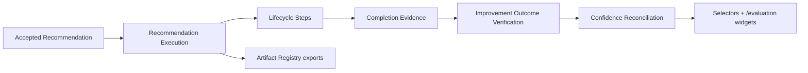

# Recommendation Execution Architecture

Sprint 8L turns accepted learning recommendations into executable improvement actions and verifies whether those actions create measurable impact.

## Runtime Files

| File | Purpose |
|---|---|
| `src/runtime/recommendation-execution.ts` | Execution domain types and lifecycle helpers |
| `src/runtime/recommendation-execution-store.ts` | Session persistence, lifecycle commands, impact verification, exports |
| `src/domain/selectors.ts` | Selector facade for execution state |

## Lifecycle

Recommendation executions support:

- `pending`
- `planned`
- `in_progress`
- `blocked`
- `completed`
- `failed`
- `cancelled`
- `verified`

Only accepted recommendations can create executions. Rejected recommendations throw before execution creation. Duplicate executions are prevented by deterministic `recommendation-execution-${recommendationId}` IDs.

## Impact Tracking

Completed executions call Improvement Outcome Verification and store a `RecommendationImpactResult`:

- outcome status
- linked outcome ID
- confidence before/after
- score delta
- verification timestamp

Verified executions increase recommendation confidence. Failed executions lower recommendation confidence.

## Governance Boundary

High-risk recommendations add a governance preflight step before applying the improvement action. This sprint models the enforcement boundary without changing governance policy logic.

## UI Integration

`/evaluation` now includes:

- Recommendation Execution panel
- lifecycle board
- start / complete / verify / cancel actions
- impact result
- linked action plan
- verification evidence

Compact widgets are attached to:

- `/runs/demo-run`
- `/execution-timeline`
- `/execution-graph`
- `/artifacts`
- `/evaluation`
- `/agents/demo-agent`

## Artifact Exports

The execution layer registers:

- `recommendation-execution.json`
- `recommendation-execution-summary.md`
- `recommendation-impact-result.json`
- `recommendation-execution-evidence.md`
