# Runtime Certification Architecture

## Purpose

Sprint 8T adds a sandbox contract testing and runtime certification layer for Hermes/Paperclip integration. The layer verifies sandbox readiness before production enablement while preserving mock fallback, governance preflight, and endpoint safety.

## Flow

```mermaid
flowchart LR
  Profile["RuntimeCertificationProfile"]
  Run["startCertificationRun"]
  Matrix["RuntimeContractTest matrix"]
  Result["RuntimeContractResult"]
  Readiness["RuntimeReadinessFinding"]
  Decision["certifyRuntime / blockCertification"]
  Artifacts["Artifact Registry"]
  Selectors["domain selectors"]
  UI["/runtime-certification and compact widgets"]

  Profile --> Run
  Run --> Matrix
  Matrix --> Result
  Result --> Readiness
  Readiness --> Decision
  Decision --> Artifacts
  Result --> Selectors
  Artifacts --> Selectors
  Selectors --> UI
```

## Safety Rules

- Certification never calls production endpoints.
- Missing sandbox environment creates `warning`, not a crash.
- Production-looking endpoints create `blocked`.
- Required tests must pass before `certified`.
- Optional warnings remain visible in readiness findings.
- Certification artifacts are registered through Artifact Registry.

## Contract Categories

- `environment_config`
- `sandbox_health`
- `authentication`
- `workspace_access`
- `tool_registry_sync`
- `model_compatibility`
- `artifact_export`
- `approval_hold`
- `governance_preflight`
- `quota_guard`
- `cost_tracking`
- `recovery_flow`
- `chaos_safety`
- `no_production_endpoint`

## Store

`src/runtime/runtime-certification-store.ts` persists:

- profiles
- certification runs
- contract results
- readiness findings
- certification artifact IDs

Storage key: `uikigai-runtime-certification-v1`.

## UI

The `/runtime-certification` route renders:

- Runtime Certification Status
- Sandbox Config Check
- Contract Test Matrix
- Safety Guard: No Production Endpoint
- Governance Preflight Result
- Artifact Export Result
- Recovery / Chaos Compatibility
- Warnings & Blockers
- Certification Report

Compact widgets are selector-driven and rendered on `/chaos`, `/worker-recovery`, `/worker-control`, `/evaluation`, `/runs/demo-run`, and `/agents/demo-agent`.

## Artifact Exports

- `runtime-certification-report.md`
- `runtime-contract-results.json`
- `sandbox-safety-report.md`
- `certification-readiness.md`
- `runtime-blockers.json`
