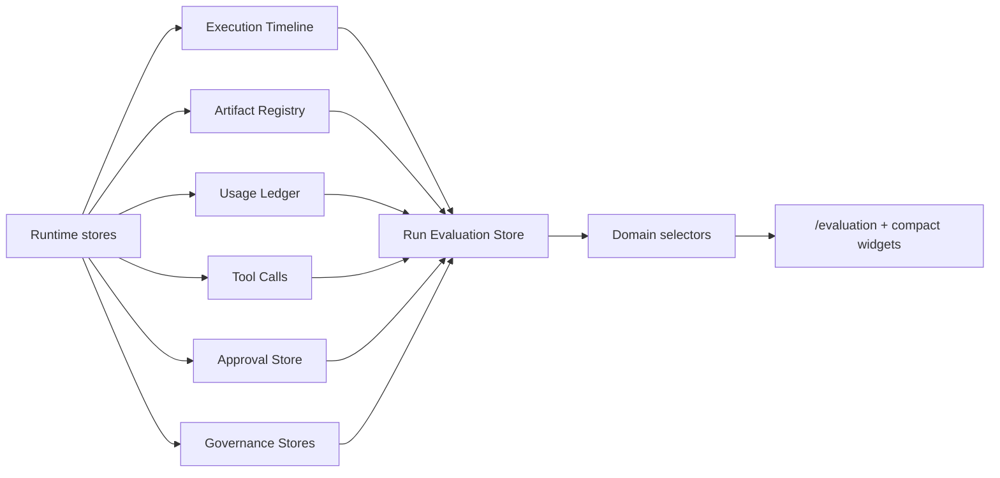

# Run Evaluation Architecture

## Purpose

Run Evaluation scores completed runtime executions using the evidence already produced by timeline, replay, artifacts, tool calls, approvals, governance, and usage stores.

## Flow

## Score Dimensions

| Dimension | Evidence |
|---|---|
| `task_completion` | Runtime status and final replay state |
| `artifact_quality` | Registered artifacts and preview metadata |
| `tool_success` | Completed versus failed runtime tool calls |
| `approval_compliance` | Pending/rejected/approved approval gates |
| `governance_compliance` | Governance decisions and enforcement blocks |
| `cost_efficiency` | Usage ledger estimated versus actual cost |
| `replay_integrity` | Timeline event count versus replay frame count |
| `overall_score` | Average of all evidence dimensions |

## Persistence

Evaluations are stored in `sessionStorage` under `uikigai-run-evaluation-v1`.

`evaluateRun(runId)` refreshes and persists the evaluation snapshot. `getRunEvaluation(runId)` returns the persisted snapshot or creates one if missing.

## Exports

The evaluation layer registers these Artifact Registry exports:

- `run-evaluation.json`
- `run-evaluation-summary.md`
- `run-quality-report.md`
- `evaluation-issues.json`

## UI Integration

Full page:

- `/evaluation`

Compact widgets:

- `/runs/demo-run`
- `/execution-timeline`
- `/execution-graph`
- `/artifacts`

The widgets are selector-backed and do not change visual layout contracts.

## Constraints

- No direct Hermes/Paperclip imports.
- No AppShell or bbox contract changes.
- No static screenshots or parity assets.
- Evaluation reads from runtime stores and selectors only.
