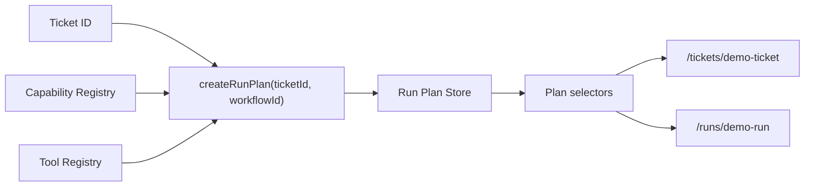

# Run Planning Engine Architecture

## Purpose

The run planning engine converts a ticket plus workflow requirement into an executable run plan before runtime execution starts.

It uses the existing registry stack:

```text
Hermes Discovery -> Tool Registry -> Capability Registry -> Run Planner
```

Runtime execution still flows through:

```text
command-actions -> runtime-orchestrator -> stores/selectors -> UI
```

## Plan Model

`RunPlan` contains:

- `id`
- `ticketId`
- `workflowId`
- `status`: `draft | ready | blocked`
- `requiredCapabilities`
- `availableCapabilities`
- `missingCapabilities`
- `steps`
- `estimatedTools`
- `estimatedArtifacts`
- `estimatedApprovals`
- `warnings`
- `createdAt`

`RunPlanStep` contains:

- `id`
- `order`
- `name`
- `capabilityId`
- `toolId`
- `modelId`
- `status`: `planned | blocked`
- `expectedOutputType`
- `requiresApproval`

## Planning Flow



## Readiness Rules

- A plan is `ready` when all required capabilities exist and every required capability maps to a compatible tool/model.
- A plan is `blocked` when a capability, tool, or compatible model is missing.
- Blocked plans cannot start runtime execution.
- Ready plans can start a mock/sandbox streaming run through `startRunFromPlan(planId)`.

## Runtime Integration

`startRunFromPlan(planId)`:

1. Reads the persisted plan.
2. Rejects blocked plans.
3. Starts the existing streaming run path.
4. Seeds `tool-call-store` with queued tool calls derived from plan steps.
5. Appends a runtime event.

The planner does not call Hermes or Paperclip clients directly.

## Persistence

`src/runtime-store/run-plan-store.ts` persists plans in `sessionStorage`.

The latest plan per ticket is tracked so ticket detail and run console can render current plan state after route navigation or reload.
