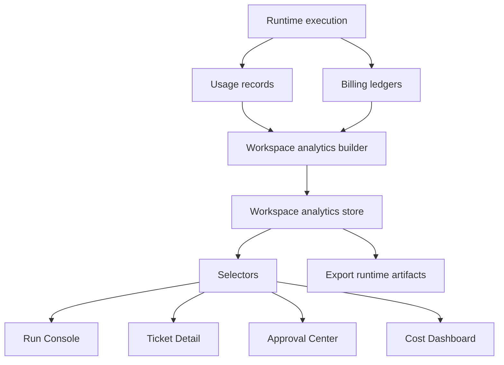

# Sprint 7H — Workspace Usage Analytics Report

## Goal

Transform the Runtime Usage Ledger into selector-driven workspace analytics for cost, token, runtime, tool, model, and workflow reporting.

## Scope

- Added workspace analytics domain and builder.
- Added session-backed workspace analytics store.
- Added selector API for workspace, tool, model, workflow, top consumer, and summary metrics.
- Wired lightweight analytics summaries into `/runs/demo-run`, `/tickets/demo-ticket`, `/approvals`, and `/cost`.
- Added analytics export artifacts for `analytics.json` and `workspace-summary.md`.
- Added smoke coverage for analytics generation, selector exposure, export artifacts, and reload persistence.

## Architecture

## Analytics Implemented

| Area | Status |
|---|---|
| Workspace totals | Pass |
| Tool analytics | Pass |
| Model analytics | Pass |
| Workflow analytics | Pass |
| Top cost tools | Pass |
| Top cost models | Pass |
| Top workflows | Pass |
| Cost variance | Pass |
| Runtime duration | Pass |
| Token totals | Pass |

## UI Wiring

| Route | Analytics Surface | Status |
|---|---|---|
| `/runs/demo-run` | Workspace Analytics summary in inspector | Pass |
| `/tickets/demo-ticket` | Workflow Analytics Summary in side card | Pass |
| `/approvals` | Approval Cost Summary via approval view model | Pass |
| `/cost` | Workspace analytics KPI dashboard | Pass |

## Export Flow

| Artifact | Type | Status |
|---|---|---|
| `analytics.json` | json | Pass |
| `workspace-summary.md` | markdown | Pass |

## Smoke Results

| Check | Result |
|---|---|
| workspace analytics generated | Pass |
| tool analytics generated | Pass |
| model analytics generated | Pass |
| workflow analytics generated | Pass |
| top rankings generated | Pass |
| cost variance calculated | Pass |
| dashboard selectors work | Pass |
| export JSON generated | Pass |
| export Markdown generated | Pass |
| analytics survives reload | Pass |

## Verification

| Command | Result |
|---|---|
| `npm run build` | Pass |
| `npm run smoke:workspace-analytics` | Pass |
| `npm run validate:demo-data` | Pass |
| `npm run audit:static-assets` | Pass |
| existing smoke suite | Pass |
| onboarding parity 01-07 | Pass |
| core bbox gates | Pass |

Smoke suite covered:

- `npm run smoke:real-ui-flow`
- `npm run smoke:interactions`
- `npm run smoke:workflow-actions`
- `npm run smoke:runtime-integration`
- `npm run smoke:runtime-persistence`
- `npm run smoke:sandbox-connectors`
- `npm run smoke:real-run-lifecycle`
- `npm run smoke:artifact-viewer`
- `npm run smoke:live-run-streaming`
- `npm run smoke:tool-runtime`
- `npm run smoke:hermes-discovery`
- `npm run smoke:tool-registry`
- `npm run smoke:capability-registry`
- `npm run smoke:run-planner`
- `npm run smoke:plan-policy`
- `npm run smoke:execution-budget`
- `npm run smoke:usage-ledger`
- `npm run smoke:workspace-analytics`

## Decision

PASS.
