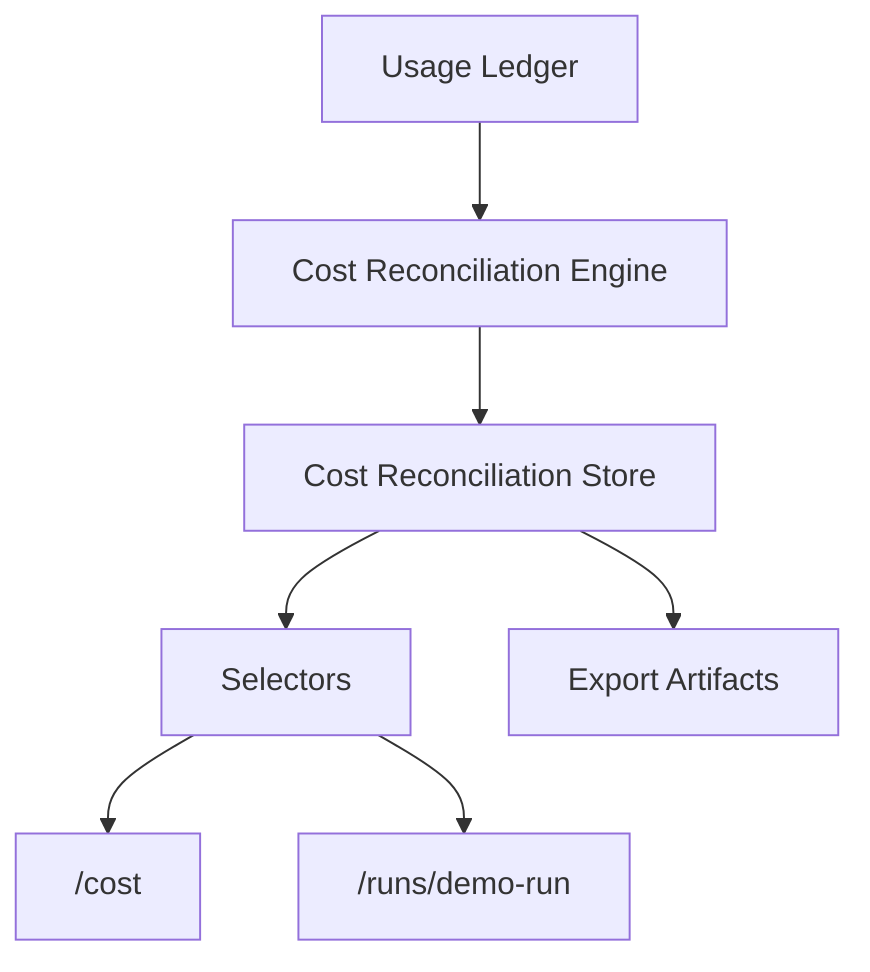

# Sprint 7I — Cost Reconciliation Dashboard Report

## Goal

Build a selector-driven Cost Reconciliation Dashboard that compares estimated cost, actual usage cost, and simulated provider cost.

## Files Added / Changed

| Area | Files |
|---|---|
| Domain | `src/runtime/cost-reconciliation.ts` |
| Store | `src/runtime/cost-reconciliation-store.ts` |
| Selectors | `src/domain/selectors.ts` |
| Orchestrator export | `src/integrations/growthos-runtime/runtime-orchestrator.ts` |
| UI wiring | `src/pages/Sprint2Screens.tsx`, `src/pages/DemoScreens.tsx` |
| Smoke | `scripts/smoke-cost-reconciliation.mjs`, `package.json` |
| Docs | `docs/13-integrations/COST_RECONCILIATION_ARCHITECTURE.md`, this report |

## Architecture Summary

## Reconciliation Metrics

| Metric | Status |
|---|---|
| Estimated Cost | Pass |
| Actual Cost | Pass |
| Provider Cost | Pass |
| Variance | Pass |
| Variance Percent | Pass |
| Severity | Pass |
| Top Cost Runs | Pass |
| Recent Alerts | Pass |
| Variance Trend | Pass |

## Artifact Exports

| Artifact | Type | Status |
|---|---|---|
| `cost-report.json` | json | Pass |
| `cost-report.md` | markdown | Pass |
| `reconciliation-report.md` | markdown | Pass |

## Smoke Results

| Check | Result |
|---|---|
| report generation | Pass |
| variance calculations | Pass |
| severity classification | Pass |
| artifact generation | Pass |
| dashboard selectors | Pass |
| cost dashboard renders | Pass |
| run console renders reconciliation | Pass |
| reconciliation survives reload | Pass |

## Verification

| Command | Result |
|---|---|
| `npm run build` | Pass |
| `npm run smoke:cost-reconciliation` | Pass |
| `npm run validate:demo-data` | Pass |
| `npm run audit:static-assets` | Pass |
| existing runtime smoke suite | Pass |
| onboarding parity 01-07 | Pass |
| core bbox gates 08/20/21/23/30/32/34/37 | Pass |

Smoke suite covered:

- `npm run smoke:real-ui-flow`
- `npm run smoke:interactions`
- `npm run smoke:workflow-actions`
- `npm run smoke:runtime-integration`
- `npm run smoke:runtime-persistence`
- `npm run smoke:sandbox-connectors`
- `npm run smoke:real-run-lifecycle`
- `npm run smoke:artifact-viewer`
- `npm run smoke:live-run-streaming`
- `npm run smoke:tool-runtime`
- `npm run smoke:hermes-discovery`
- `npm run smoke:tool-registry`
- `npm run smoke:capability-registry`
- `npm run smoke:run-planner`
- `npm run smoke:plan-policy`
- `npm run smoke:execution-budget`
- `npm run smoke:usage-ledger`
- `npm run smoke:workspace-analytics`
- `npm run smoke:cost-reconciliation`

## Decision

PASS.
