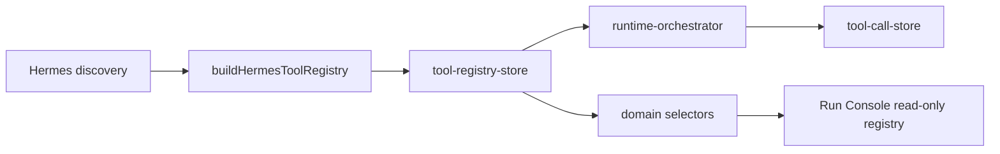

# Hermes Tool Registry Architecture

## Purpose

The Hermes Tool Registry converts Hermes discovery output into a runtime-ready registry of tools, capabilities, models, and compatibility mappings. Runtime execution no longer depends on a hardcoded tool list.

## Flow

## Registry Contract

`HermesTool` includes:
- `id`
- `name`
- `category`
- `description`
- `enabled`
- `supportsStreaming`
- `supportsArtifacts`
- `supportsApproval`
- `supportedModels`
- `capabilityRequirements`

`ToolCompatibility` answers whether a discovered tool can run on a discovered model:
- `toolId`
- `modelId`
- `supported`
- `reason`

## Mapping Rules

| Source | Registry output |
|---|---|
| `discovery.tools` | `HermesTool[]` |
| `discovery.models` | `models` |
| `discovery.capabilities` | `capabilities` |
| tool + model pairs | `compatibility` matrix |

If Hermes returns no tools, the registry uses the mock discovery fallback so runtime smoke tests and demo mode remain stable.

## Runtime Integration

Streaming runtime calls `getToolRegistry()` and selects enabled streaming tools from the registry. The deterministic stream sequence remains, but tool ids, names, descriptions, artifact support, and approval support come from the registry.

## UI Boundary

The Run Console reads registry state through selectors. It displays:
- tool registry status/count
- available tool
- tool capability
- compatible model mapping count

No React component imports Hermes clients directly.

## Persistence

`src/runtime-store/tool-registry-store.ts` persists registry data in sessionStorage under `uikigai-hermes-tool-registry-v1`.
