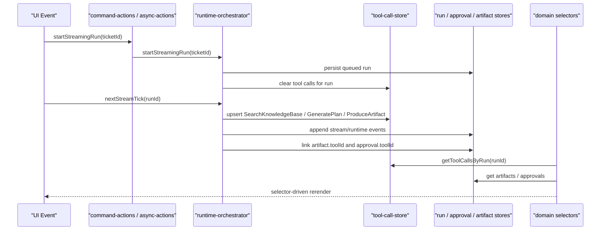

# Tool Runtime Architecture

## Purpose

Sprint 6G adds structured tool-call execution tracking to the GrowthOS runtime layer. Streaming events remain the chronological feed, while tool calls are now persisted as first-class runtime records that can be queried by run, linked to artifacts, and referenced by approvals.

## Flow



## Runtime Tool Model

`RuntimeToolCall` is stored in `src/runtime-store/tool-call-store.ts` and persisted inside the shared sessionStorage runtime state.

Fields:
- `id`
- `runId`
- `toolName`
- `status`: `queued`, `running`, `completed`, `failed`
- `startedAt`
- `finishedAt`
- `input`
- `output`
- `durationMs`
- `metadata`

Selectors:
- `getToolCallsByRun(runId)`
- `getActiveToolCall(runId)`
- `getCompletedToolCalls(runId)`
- `getToolCallById(toolCallId)`

## Streaming Tool Chain

The mock streaming lifecycle now produces deterministic structured tools:

| Order | Tool | Purpose |
|---:|---|---|
| 1 | SearchKnowledgeBase | Load ticket, policy, and prior runtime context |
| 2 | GeneratePlan | Turn context into a Hermes execution plan |
| 3 | ProduceArtifact | Generate Paperclip QA packet and runtime artifacts |

Each tool emits:
- `tool.started`
- `tool.progress`
- `tool.completed`

The runtime store keeps the tool object in sync with the stream event timeline.

## Linking Rules

Artifacts created during `artifact.created` include `toolId`.

Approvals created during `approval.requested` include `toolId`.

Selectors resolve the originating tool name for:
- Run Console tool calls panel
- Ticket detail execution summary
- Approval Center queue/detail
- Artifact Viewer generated-by metadata

## Boundary Rule

React components do not import Hermes or Paperclip clients. UI reads through selectors and runtime stores only. The integration path remains:

```text
UI Event -> command action -> runtime-orchestrator -> adapter/client or mock -> runtime-store -> selector -> UI
```
