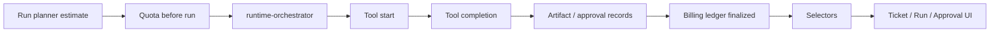

# Usage Ledger Architecture

## Purpose

The usage ledger records actual runtime consumption after a plan estimate has been approved for execution. It sits on top of Sprint 7F execution budget estimates and keeps mock/sandbox runtime behavior deterministic without adding a real billing provider.

## Flow

## Records

`UsageRecord` supports:

- `token`
- `tool_call`
- `artifact`
- `approval`
- `runtime_duration`
- `external_api`

Each record stores estimated cost, actual cost, quantity, unit, optional tool/model/artifact links, and metadata.

## Persistence

`src/runtime-store/usage-ledger-store.ts` persists records, ledgers, quotas, and quota reports in `sessionStorage` under `uikigai-runtime-usage-ledger-v1`.

## Quota Evaluation

The runtime evaluates quota at three points:

- `evaluateQuotaBeforeRun(planId)`: blocks plan start if estimate exceeds quota.
- `evaluateQuotaDuringRun(runId)`: warns or pauses a running stream if actual usage exceeds quota.
- `evaluateQuotaAfterRun(runId)`: finalizes billing and records final quota state.

## Runtime Integration

`runtime-orchestrator` is the only integration entry. UI components do not write usage records directly.

- run start creates runtime duration seed record.
- tool start creates `tool_call` usage.
- tool completion creates token and duration usage.
- artifact creation creates artifact usage.
- approval request creates approval usage.
- run completion finalizes the billing ledger.

## Selector Boundary

UI reads usage through selectors:

- `selectUsageLedger(runId)`
- `selectActualRunCost(runId)`
- `selectEstimatedVsActualCost(runId)`
- `selectQuotaStatus(targetId?)`
- `selectQuotaWarnings(runId?)`
- `selectBillingRecordsByRun(runId)`

## Mock/Sandbox Behavior

Mock and sandbox-missing-config modes both produce deterministic records. Real provider billing can be mapped later by replacing actual cost sources inside runtime-orchestrator without changing UI components.
