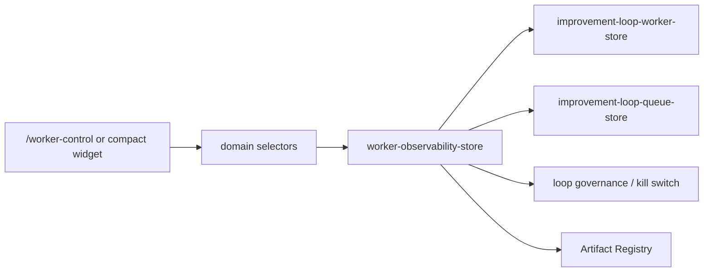

# Worker Observability Architecture

## Purpose

Sprint 8Q adds a selector-driven observability and control surface for the Autonomous Improvement Loop Worker. It does not change AppShell, runtime governance, queue scheduling rules, or visual parity contracts.

## Flow

## Models

- `WorkerObservation`: current status, active queue item, heartbeat, tick count, retry count, wait times, stale warning, SLA status.
- `WorkerRunTrace`: ordered tick/result trace for the active worker.
- `WorkerHealthSnapshot`: heartbeat age, stale state, incident count, SLA state.
- `WorkerControlAction`: safe control request log for pause, resume, stop, kill, retry, skip, requeue, approval escalation, diagnostics export.
- `WorkerIncident`: failure, stale, SLA, policy, retry, and manual kill events.
- `WorkerSLAStatus`: `healthy`, `warning`, `breached`.

## Control Actions

Control actions remain store-mediated. UI components call action functions from `worker-observability-store`, which validate eligibility, log audit actions, and then call worker/queue/governance store APIs.

Supported controls:

- `requestWorkerPause`
- `requestWorkerResume`
- `requestWorkerStop`
- `requestWorkerKill`
- `requestWorkerRetryNow`
- `requestWorkerSkipItem`
- `requestWorkerRequeueItem`
- `requestWorkerEscalateToApproval`
- `requestWorkerExportDiagnostics`

Rules:

- Skip and requeue require a reason.
- Retry respects queue retry policy.
- Kill enables the global loop kill switch and records a critical incident.
- Diagnostics register audit artifacts through Artifact Registry.

## Selectors

`src/domain/selectors.ts` exposes:

- `selectWorkerObservationDashboard`
- `selectWorkerCurrentTrace`
- `selectWorkerHealthSnapshot`
- `selectWorkerIncidents`
- `selectWorkerControlEligibility`
- `selectWorkerSLAStatus`
- `selectWorkerDiagnosticsArtifacts`

## UI Surfaces

- `/worker-control`: full dashboard with worker status, active queue item, execution trace, health, incidents, control actions, diagnostics.
- Compact widgets: `/evaluation`, `/runs/demo-run`, `/execution-timeline`, `/execution-graph`, `/artifacts`, `/agents/demo-agent`.

## Artifact Exports

Diagnostics export registers:

- `worker-observation.json`
- `worker-health-report.md`
- `worker-incidents.json`
- `worker-control-audit.md`
- `worker-diagnostics.json`

## Persistence

Worker observability data persists in sessionStorage under `uikigai-worker-observability-v1`. Worker, queue, governance, and artifact stores keep their existing storage boundaries.
