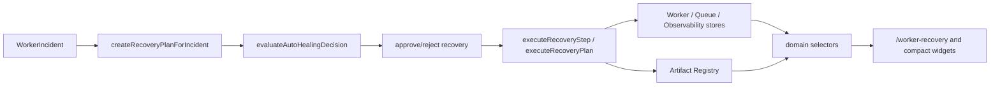

# Worker Recovery Architecture

## Purpose

Sprint 8R adds Worker Incident Recovery and Auto-Healing on top of Worker Observability. The layer turns worker incidents into recovery plans, evaluates whether a plan can run automatically, executes approved steps, records audit events, and exports recovery evidence through Artifact Registry.

## Flow

## Models

- `WorkerRecoveryPlan`
- `WorkerRecoveryStep`
- `WorkerRecoveryAttempt`
- `WorkerRecoveryPolicy`
- `WorkerRecoveryResult`
- `WorkerRecoveryIncidentLink`
- `AutoHealingDecision`

## Recovery Reasons

- `stale_worker`
- `heartbeat_missing`
- `queue_item_failed`
- `retry_exhausted`
- `governance_blocked`
- `approval_timeout`
- `sla_breach`
- `tool_failure`
- `artifact_generation_failed`
- `unknown_runtime_error`

## Recovery Actions

- `restart_worker`
- `retry_current_item`
- `requeue_item`
- `skip_item`
- `pause_for_review`
- `escalate_to_approval`
- `export_diagnostics`
- `rollback_last_action`
- `kill_worker`
- `mark_unrecoverable`

## Auto-Healing Rules

- Low-risk recovery can auto-execute.
- Medium, high, and critical recovery require approval.
- Rollback, kill, skip, and unrecoverable actions require an explicit reason.
- Recovery writes audit attempts and links back to the original worker incident.
- Recovery actions go through existing worker, queue, observability, and governance stores.

## Selectors

`src/domain/selectors.ts` exposes:

- `selectWorkerRecoveryDashboard`
- `selectRecoveryPlans`
- `selectRecoveryPlanByIncident`
- `selectActiveRecoveryPlan`
- `selectAutoHealingDecisions`
- `selectRecoveryAuditTrail`
- `selectUnresolvedRecoveryIncidents`
- `selectRecoveryReadiness`

## UI

- Full route: `/worker-recovery`
- Compact widgets:
  - `/worker-control`
  - `/evaluation`
  - `/runs/demo-run`
  - `/execution-timeline`
  - `/execution-graph`
  - `/artifacts`
  - `/agents/demo-agent`

## Artifact Exports

- `worker-recovery-plan.json`
- `worker-recovery-report.md`
- `worker-auto-healing-decisions.json`
- `worker-recovery-audit.md`
- `unresolved-worker-incidents.md`

## Persistence

Recovery state persists in sessionStorage under `uikigai-worker-recovery-v1`.
