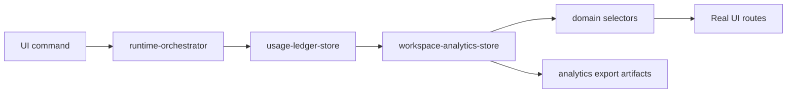

# Workspace Analytics Architecture

## Purpose

Workspace Analytics turns the runtime usage ledger into workspace-level reporting for cost, tokens, runtime, tools, models, and workflows. It does not create a second source of truth. Analytics are rebuilt from persisted usage records and billing ledgers.

## Flow

## Source Of Truth

Runtime usage remains the source of truth:

- `UsageRecord` entries capture tool calls, tokens, duration, artifacts, approvals, and run lifecycle usage.
- `BillingLedger` entries capture estimated and actual cost per run.
- `generateWorkspaceAnalytics()` rebuilds analytics from `getAllUsageRecords()` and `getBillingLedgers()`.

## Analytics Model

Workspace totals:

- total runs
- total tool calls
- total artifacts
- total approvals
- estimated cost
- actual cost
- variance cost
- total tokens
- total runtime minutes

Top consumers:

- tools ranked by cost, executions, and duration
- models ranked by cost and tokens
- workflows ranked by cost and duration

## Selector Flow

Selectors in `src/domain/selectors.ts` expose the analytics layer:

- `selectWorkspaceAnalytics()`
- `selectToolAnalytics()`
- `selectModelAnalytics()`
- `selectWorkflowAnalytics()`
- `selectTopCostTools()`
- `selectTopCostModels()`
- `selectTopWorkflows()`
- `selectWorkspaceCostSummary()`
- `selectWorkspaceTokenSummary()`
- `selectWorkspaceRuntimeSummary()`

UI routes continue to render through selector outputs instead of reading runtime stores directly.

## Dashboard Wiring

- `/runs/demo-run` shows a Workspace Analytics summary in the existing inspector card.
- `/tickets/demo-ticket` shows workflow cost and duration in the existing side cost card.
- `/approvals` includes approval-related cost in approval center summary data.
- `/cost` receives workspace analytics KPIs for total cost, tokens, runs, runtime, top tool, top model, top workflow, and variance.

No AppShell geometry or bbox contracts are changed by this layer.

## Export Flow

`exportWorkspaceAnalyticsArtifacts()` generates runtime artifacts through the orchestrator:

- `analytics.json`
- `workspace-summary.md`

Both artifacts are written through the runtime artifact store and are compatible with the existing Artifact Viewer.

## Persistence

`workspace-analytics-store` persists the latest generated analytics bundle in sessionStorage. The bundle can be regenerated at any time from the usage ledger.
