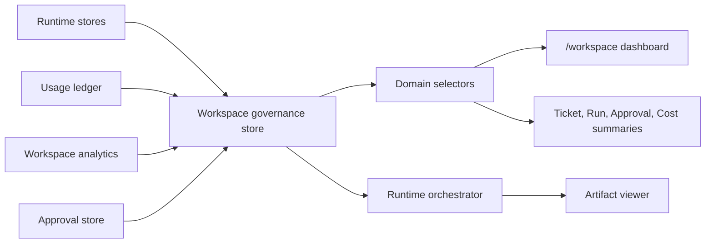

# Workspace Governance Architecture

## Purpose

Workspace governance adds a read-only workspace control layer on top of runtime usage, billing, approvals, and workspace analytics. It does not enforce backend auth or RBAC. It provides frontend governance state for demo runtime decisions and operator visibility.

## Flow

## Domain

The governance domain lives in `src/runtime/workspace-governance.ts`.

| Model | Purpose |
|---|---|
| `Workspace` | Workspace identity and status. |
| `WorkspaceTeam` | Team hierarchy for member assignment. |
| `WorkspaceMember` | Member, team, and role mapping. |
| `WorkspaceRole` | Read-only role labels: `ADMIN`, `MANAGER`, `OPERATOR`, `VIEWER`. |
| `WorkspaceBudget` | Monthly limit, current spend, and remaining budget. |
| `WorkspaceQuota` | Run, token, and artifact limits/usage. |
| `WorkspaceHealth` | Budget, quota, policy, and overall status. |

## Store

The store lives in `src/runtime/workspace-governance-store.ts` and persists to sessionStorage under `uikigai-workspace-governance-v1`.

Persisted state:
- workspaces
- teams
- members
- roles
- budgets
- quotas
- health reports

Selector reads are side-effect free. `generateWorkspaceGovernance()` is the explicit write path for refreshing persisted governance state.

## Governance Rules

Budget:
- `OK`: current spend is at or below 90% of monthly limit.
- `WARNING`: current spend is above 90%.
- `CRITICAL`: current spend exceeds monthly limit.

Quota:
- `OK`: all quotas are at or below 90%.
- `WARNING`: any quota is above 90%.
- `BLOCKED`: any quota exceeds its limit.

Overall status uses the highest severity across budget, quota, and policy status.

## Selectors

Workspace governance selectors are exported from `src/domain/selectors.ts`:

- `selectCurrentWorkspace`
- `selectWorkspaceBudget`
- `selectWorkspaceQuota`
- `selectWorkspaceUsage`
- `selectWorkspaceMembers`
- `selectWorkspaceTeams`
- `selectWorkspaceRoles`
- `selectWorkspaceHealth`
- `selectWorkspaceWarnings`
- `selectWorkspaceGovernanceSummary`
- `selectWorkspaceGovernanceViewModel`

## UI Wiring

The read-only dashboard route is `/workspace`.

Existing screens receive governance summaries through selectors:
- `/tickets/demo-ticket`
- `/runs/demo-run`
- `/approvals`
- `/cost`

## Artifacts

The runtime orchestrator exports governance evidence through `exportWorkspaceGovernanceArtifacts()`.

Generated artifacts:
- `workspace-governance.json`
- `workspace-summary.md`
- `workspace-health-report.md`

Artifacts are stored through `runtime-store/artifact-store` and are visible through the existing artifact viewer.
